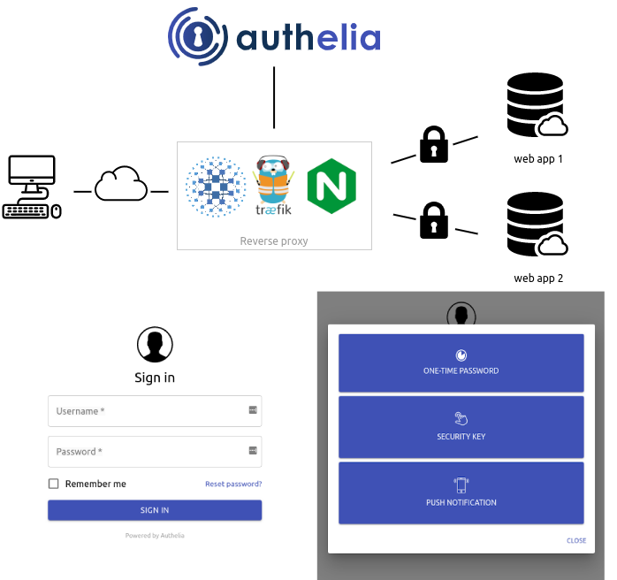

# Authelia

**Authelia** یک سرویس احراز هویت دو مرحله‌ای (2FA) و مدیریت دسترسی است که به شما این امکان را می‌دهد که امنیت سیستم‌های مختلف خود را با استفاده از احراز هویت چندعاملی (MFA) بهبود ببخشید. این ابزار معمولاً برای محافظت از اپلیکیشن‌های وب و سرورهای خصوصی استفاده می‌شود. Authelia می‌تواند به‌طور یکپارچه با پراکسی‌های معکوس (reverse proxy) مانند Nginx و Traefik کار کند و به شما اجازه می‌دهد تا سیاست‌های دسترسی پیچیده‌تری را برای خدمات و منابع خود تعیین کنید.

## اسکرین شات

در زیر یک تصویر از رابط کاربری Authelia آورده شده است:



### جهت اجرای Authelia با استفاده از Docker Compose، دستور زیر را وارد کنید:

```bash
sudo docker compose up -d
```


