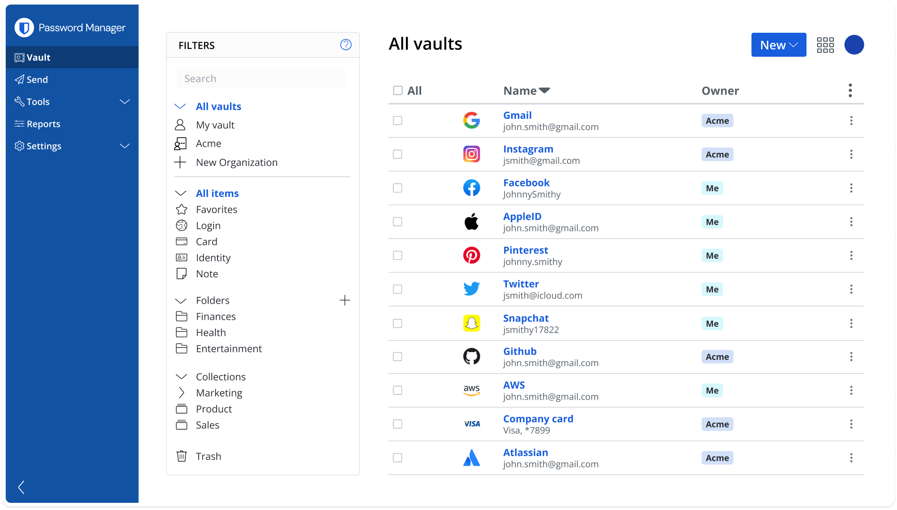

# Bitwarden

**Bitwarden** یک سرویس مدیریت رمز عبور متن‌باز است که به کاربران امکان می‌دهد رمزهای عبور و اطلاعات حساس خود را به‌صورت امن ذخیره کرده و مدیریت کنند. این ابزار به کاربران این امکان را می‌دهد که به راحتی رمزهای عبور خود را در دستگاه‌های مختلف همگام‌سازی کنند، رمزهای عبور پیچیده و امن بسازند، و آن‌ها را به‌طور خودکار در فرم‌ها و وب‌سایت‌ها وارد کنند. **Bitwarden** همچنین از قابلیت‌های اشتراک‌گذاری امن برای گروه‌ها و تیم‌ها پشتیبانی می‌کند و می‌تواند در محیط‌های مختلف مانند دسکتاپ، موبایل، و مرورگرها استفاده شود. با کد باز بودن آن، **Bitwarden** به‌طور مداوم توسط جامعه‌ای از توسعه‌دهندگان بهبود یافته و از نظر امنیتی بسیار مورد اعتماد است.

## اسکرین شات

در زیر یک تصویر از رابط کاربری Bitwarden آورده شده است:



### جهت اجرای Bitwarden با استفاده از Docker Compose، دستور زیر را وارد کنید:

```bash
sudo docker compose up -d
```


