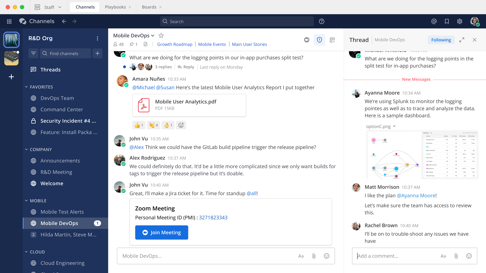

# Mattermost

**Mattermost** یک پلتفرم متن‌باز و تیمی برای ارتباطات و همکاری درون سازمانی است که به‌طور خاص برای تسهیل مکالمات گروهی و مدیریت پروژه‌ها طراحی شده است. این ابزار قابلیت‌های گسترده‌ای نظیر پیام‌رسانی در زمان واقعی، ارسال فایل، و اشتراک‌گذاری اسناد را ارائه می‌دهد و به تیم‌ها کمک می‌کند تا به‌صورت هماهنگ و متمرکز کار کنند. Mattermost برای سازمان‌هایی که نیاز به کنترل بیشتر روی داده‌ها و امنیت دارند، گزینه‌ای مناسب است، زیرا می‌توان آن را روی سرورهای داخلی نصب و مدیریت کرد. همچنین، این پلتفرم قابلیت‌های متنوعی مانند ادغام با ابزارهای دیگر، ایجاد کانال‌های تیمی، و مدیریت دسترسی‌های کاربران را فراهم می‌آورد.

**Focalboard** یک ابزار مدیریت پروژه و وظایف متن‌باز است که به‌طور خاص برای کمک به تیم‌ها در برنامه‌ریزی، پیگیری، و اجرای پروژه‌ها طراحی شده است. این پلتفرم قابلیت‌های مشابهی به Trello و Asana دارد و امکان ایجاد تخته‌های Kanban، تقویم‌ها، و فهرست‌های وظایف را فراهم می‌کند. Focalboard به تیم‌ها این امکان را می‌دهد که به‌صورت بصری و سازمان‌یافته، کارها و پروژه‌های خود را مدیریت کرده و به راحتی اولویت‌ها و مهلت‌های پروژه‌ها را پیگیری کنند. با استفاده از Focalboard، تیم‌ها می‌توانند همکاری بهتری داشته باشند و به اهداف خود دست یابند، در حالی که همچنان کنترل کاملی بر داده‌ها و ساختار پروژه‌های خود دارند.

## اسکرین شات

در زیر یک تصویر از رابط کاربری Mattermost آورده شده است:



### جهت اجرای Mattermost با استفاده از Docker Compose، دستور زیر را وارد کنید:

```bash
sudo docker compose up -d
```
