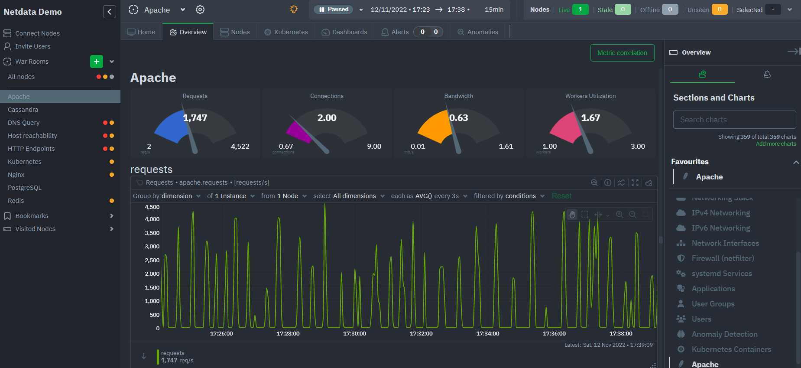

# Netdata

**Netdata** یک پلتفرم نظارتی منبع باز است که به منظور نظارت بر عملکرد سیستم‌ها، سرورها، برنامه‌ها و زیرساخت‌های IT طراحی شده است. این ابزار به شما امکان می‌دهد که به صورت لحظه‌ای عملکرد سیستم خود را نظارت کنید و اطلاعات دقیقی از متریک‌های مختلف به دست آورید. یکی از ویژگی‌های برجسته Netdata، نمایش داده‌های نظارتی در قالب گراف‌ها و نمودارهای زمان واقعی است که به شما کمک می‌کند تا وضعیت سیستم خود را به راحتی و به طور فوری بررسی کنید.

**Netdata** قادر است که اطلاعات متنوعی از جمله مصرف CPU، حافظه، دیسک، شبکه، فرآیندهای در حال اجرا، پایگاه داده‌ها، و بسیاری از خدمات دیگر را جمع‌آوری و نمایش دهد. این اطلاعات به صورت یکپارچه و در زمان واقعی به نمایش در می‌آید که به کاربران اجازه می‌دهد مشکلات و ناهنجاری‌های سیستمی را به سرعت شناسایی کنند.

**Netdata** قابلیت نصب بسیار آسانی دارد و می‌تواند در سرورها و سیستم‌های مختلف به صورت محلی یا در محیط‌های ابری نصب شود. علاوه بر این، این ابزار از داشبوردهای تعاملی و گرافیکی برای نمایش داده‌های نظارتی استفاده می‌کند که باعث می‌شود اطلاعات برای تحلیلگران و تیم‌های فنی به راحتی قابل درک باشد. همچنین، Netdata قابلیت ارسال هشدارها و آلارم‌ها را دارد، به این معنی که می‌تواند در صورت بروز مشکلات یا شرایط بحرانی، به مدیران سیستم اطلاع دهد.

یکی از دیگر ویژگی‌های مهم Netdata این است که هیچ گونه تاثیر قابل توجهی بر عملکرد سیستم ندارد، زیرا این ابزار بهینه‌سازی شده و به طور معمول از منابع بسیار کمی استفاده می‌کند. در نتیجه، می‌توان آن را روی هر سیستم یا ماشین‌ مجازی به راحتی پیاده‌سازی کرد و اطلاعات دقیقی در مورد سلامت و عملکرد سیستم جمع‌آوری کرد.

## اسکرین شات

در زیر یک تصویر از رابط کاربری Netdata آورده شده است:



### جهت اجرای Netdata با استفاده از Docker Compose، دستور زیر را وارد کنید:

```bash
sudo docker compose up -d
```

