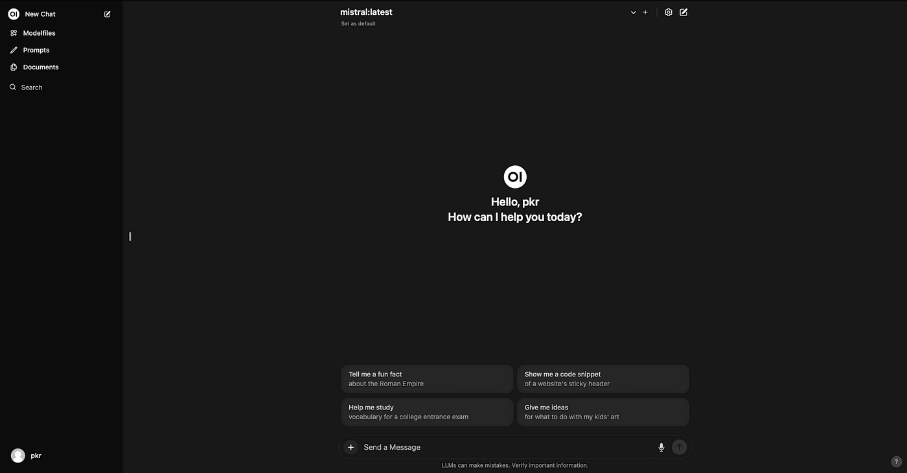

# Open WebUI

**Open WebUI** یک رابط کاربری متن‌باز برای مدیریت و تعامل با مدل‌های هوش مصنوعی مانند ChatGPT است. این ابزار به کاربران اجازه می‌دهد تا بدون نیاز به خط فرمان، به‌راحتی با مدل‌های زبان بزرگ (LLMs) کار کنند. Open WebUI از طریق یک محیط کاربری ساده و قابل تنظیم، امکان ارسال پیام، مدیریت تنظیمات و مشاهده تاریخچه گفتگوها را فراهم می‌کند. این پروژه معمولاً برای استفاده شخصی یا سازمانی در سرورهای خصوصی اجرا می‌شود و می‌تواند به مدل‌های محلی یا APIهای ابری متصل شود، که آن را به گزینه‌ای قدرتمند برای کنترل و سفارشی‌سازی تعاملات هوش مصنوعی تبدیل می‌کند.

## اسکرین شات

در زیر یک تصویر از رابط کاربری Open WebUI آورده شده است:



## جهت اجرای Open WebUI با استفاده از Docker Compose، دستور زیر را وارد کنید:

```bash
sudo docker compose up -d
```

