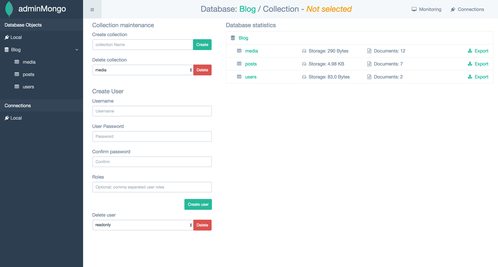

# AdminMongo

**AdminMongo** یک ابزار گرافیکی متن‌باز برای مدیریت پایگاه داده MongoDB است که رابط کاربری ساده و کاربردی برای تعامل با این پایگاه داده NoSQL فراهم می‌کند. با استفاده از AdminMongo، کاربران می‌توانند به‌راحتی داده‌ها را مشاهده، ویرایش، جستجو، و مدیریت کنند، بدون اینکه نیازی به استفاده از خط فرمان یا نوشتن دستورات پیچیده MongoDB داشته باشند. این ابزار امکاناتی نظیر مشاهده collections، جستجوی پیشرفته، مدیریت شاخص‌ها، انجام عملیات روی داده‌ها (مانند افزودن، حذف، یا به‌روزرسانی اسناد) و همچنین مدیریت کاربران و دسترسی‌ها را ارائه می‌دهد. AdminMongo به‌ویژه برای توسعه‌دهندگان و مدیران پایگاه داده‌هایی که از MongoDB استفاده می‌کنند، ابزاری مفید است و به آنها کمک می‌کند تا عملکرد سریع‌تری در مدیریت پایگاه داده‌های خود داشته باشند.

## اسکرین شات

در زیر یک تصویر از رابط کاربری AdminMongo آورده شده است:



### جهت اجرای AdminMongo با استفاده از Docker Compose، دستور زیر را وارد کنید:

```bash
sudo docker compose up -d
```


