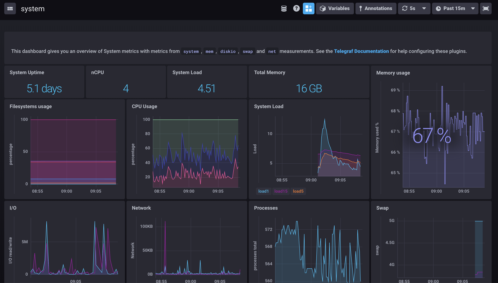

# Chronograf و InfluxDB

**Chronograf و InfluxDB** ابزارهای مرتبط با یکدیگر هستند که برای نظارت، تجزیه و تحلیل و ذخیره‌سازی داده‌های زمانی (time-series data) استفاده می‌شوند. این دو ابزار بخشی از نرم‌افزار Telegraf/InfluxDB/Chronograf (TICK Stack) هستند که به‌طور خاص برای پردازش و نظارت بر داده‌های زمان‌بندی شده طراحی شده‌اند.

**InfluxDB:**
InfluxDB یک پایگاه داده زمان‌سری (time-series database) متن‌باز است که برای ذخیره‌سازی و مدیریت داده‌های زمانی، مانند داده‌های سنسور، عملکرد سیستم‌ها، آمارهای وب‌سایت و لاگ‌ها، طراحی شده است. این پایگاه داده بسیار سریع است و برای ذخیره‌سازی مقادیر زمانی که به‌طور مداوم به روز می‌شوند، مانند دما، مصرف انرژی، یا عملکرد سرورها، بسیار مناسب است. InfluxDB از زبان پرس‌وجو SQL-like برای دسترسی و تجزیه و تحلیل داده‌ها استفاده می‌کند و امکان ذخیره‌سازی داده‌های پرحجم و انجام عملیات پیچیده روی داده‌ها را فراهم می‌آورد. ویژگی‌های اصلی آن شامل مقیاس‌پذیری، کارایی بالا، پشتیبانی از داده‌های متغیر و فشرده‌سازی داده‌ها می‌باشد.

**Chronograf:**
Chronograf یک رابط کاربری گرافیکی (GUI) است که برای مشاهده، تجزیه و تحلیل و نظارت بر داده‌های ذخیره‌شده در InfluxDB طراحی شده است. این ابزار به کاربران این امکان را می‌دهد که به راحتی داشبوردهای سفارشی ایجاد کرده و داده‌های زمانی را به‌صورت گرافیکی و در زمان واقعی مشاهده کنند. Chronograf علاوه بر نمایش داده‌ها، امکاناتی برای تعریف هشدارها و نظارت بر شرایط مختلف، از جمله وضعیت سرورها، برنامه‌ها و سرویس‌ها را فراهم می‌آورد. این ابزار به‌ویژه برای کاربرانی که نیاز به یک رابط کاربری بصری برای تجزیه و تحلیل داده‌های زمانی دارند، بسیار مفید است.

**کاربرد ترکیبی Chronograf و InfluxDB:**
ترکیب InfluxDB به‌عنوان پایگاه داده و Chronograf به‌عنوان رابط کاربری، یک راهکار کامل برای ذخیره‌سازی، مشاهده و تجزیه و تحلیل داده‌های زمانی فراهم می‌آورد. به‌طور کلی، این مجموعه برای مواردی مانند نظارت بر عملکرد سیستم‌ها، تجزیه و تحلیل داده‌های سنسور در اینترنت اشیا (IoT)، آمار وب، و حتی مانیتورینگ اپلیکیشن‌های پیچیده کاربرد دارد.

## اسکرین شات

در زیر یک تصویر از رابط کاربری Chronograf و InfluxDB آورده شده است:



### جهت اجرای Chronograf و InfluxDB با استفاده از Docker Compose، دستور زیر را وارد کنید:

```bash
sudo docker compose up -d
```
