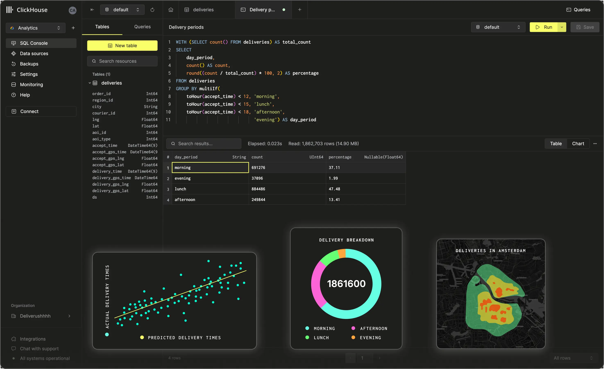

# ClickHouse

**ClickHouse** یک پایگاه داده تحلیلی متن‌باز است که برای پردازش سریع داده‌های حجیم به‌صورت آنلاین (OLAP) طراحی شده است. این سیستم به‌ویژه برای پردازش و تحلیل داده‌های بزرگ و پیچیده در زمان واقعی مناسب است و به دلیل سرعت بالای ذخیره‌سازی و جستجو در داده‌های ساختاریافته، در کاربردهایی مانند تجزیه و تحلیل داده‌های تجاری، گزارش‌دهی، و سیستم‌های پیشنهاددهی محبوب است. ClickHouse از معماری توزیع‌شده و مقیاس‌پذیر برخوردار است که به آن امکان می‌دهد داده‌ها را در خوشه‌های بزرگ به‌صورت موازی پردازش کند، به‌طور قابل توجهی سرعت درخواست‌های تحلیلی را افزایش دهد. این پایگاه داده از فشرده‌سازی داده‌ها و ذخیره‌سازی کارآمد پشتیبانی می‌کند و می‌تواند به‌طور مؤثری با سیستم‌های دیگر مانند Kafka، Hadoop و دیگر منابع داده‌های بزرگ یکپارچه شود.

## اسکرین شات

در زیر یک تصویر از رابط کاربری ClickHouse آورده شده است:



### جهت اجرای ClickHouse با استفاده از Docker Compose، دستور زیر را وارد کنید:

```bash
sudo docker compose up -d
```


پایگاه داده تحلیلی برای پردازش سریع داده‌ها

