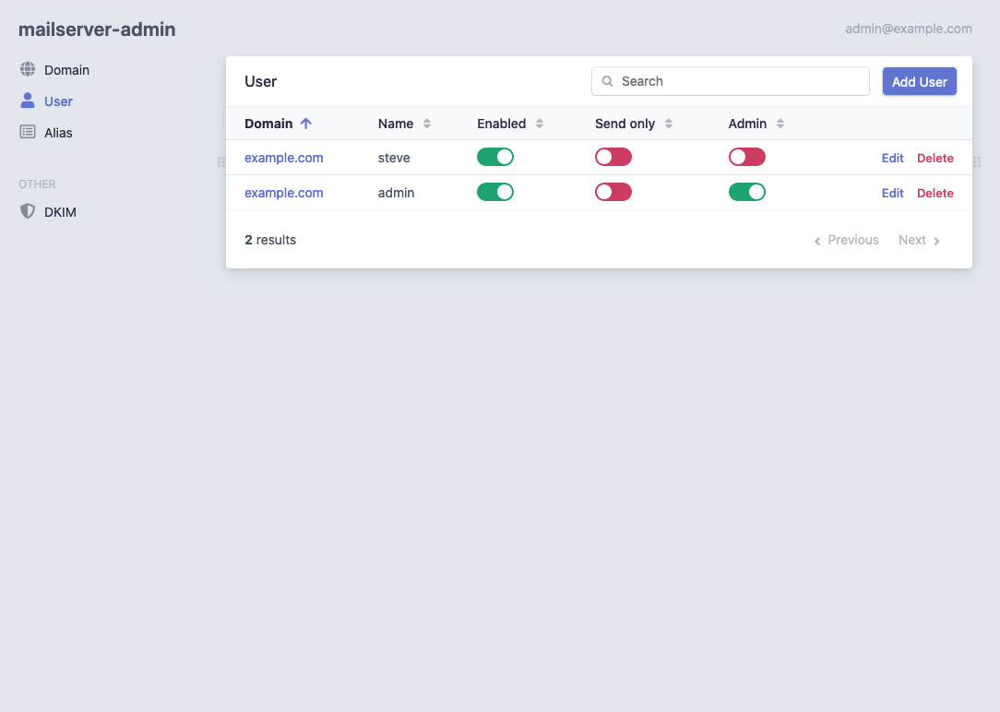

# Docker Mailserver

**Docker Mailserver** یک راه‌حل مبتنی بر کانتینر برای راه‌اندازی و مدیریت سرور ایمیل است که به‌راحتی از طریق Docker قابل استقرار است. این پروژه شامل مجموعه‌ای از ابزارها و سرویس‌های مختلف است که برای راه‌اندازی یک سرور ایمیل کامل طراحی شده‌اند، از جمله SMTP، IMAP، POP3 و فیلترهای اسپم. Docker Mailserver شامل ویژگی‌هایی مانند احراز هویت ایمیل، رمزگذاری TLS/SSL، و قابلیت‌های مدیریت ایمیل است. این ابزار به‌ویژه برای افرادی که نیاز به راه‌اندازی یک سرور ایمیل شخصی یا سازمانی دارند، بدون نیاز به پیکربندی پیچیده و نرم‌افزارهای جانبی، بسیار مفید است. با استفاده از Docker، این سرور ایمیل به‌راحتی قابل مدیریت، مقیاس‌پذیر و قابل حمل است، و می‌توان آن را در هر محیطی که از Docker پشتیبانی می‌کند اجرا کرد.

## اسکرین شات

در زیر یک تصویر از رابط کاربری Docker Mailserver آورده شده است:



### جهت اجرای Docker Mailserver با استفاده از Docker Compose، دستور زیر را وارد کنید:

```bash
sudo docker compose up -d
```

