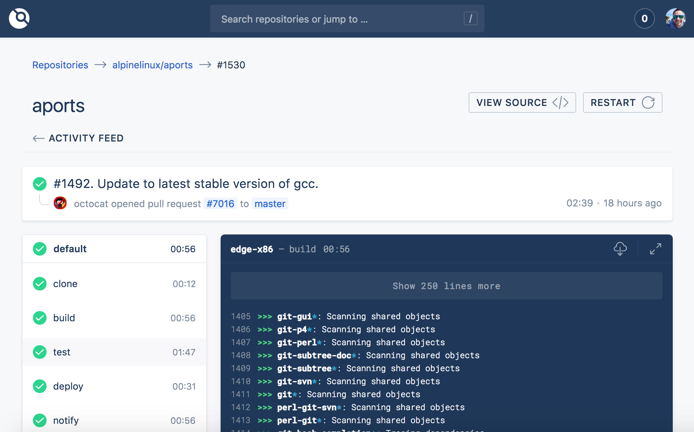

# Drone

**Drone** یک ابزار متن‌باز برای اتوماسیون CI/CD (یکپارچگی مداوم و تحویل مداوم) است که به توسعه‌دهندگان کمک می‌کند فرآیندهای ساخت، تست و استقرار نرم‌افزار را به‌صورت خودکار انجام دهند. این پلتفرم برای مدیریت و اجرای pipeline‌های پیچیده طراحی شده است و از کانتینرهای Docker برای اجرای مراحل مختلف استفاده می‌کند. Drone به توسعه‌دهندگان این امکان را می‌دهد که برای هر پروژه خود یک سری مراحل اتوماتیک تعریف کنند، از جمله ساخت و آزمایش کد، استقرار به محیط‌های مختلف، و حتی انجام فرایندهای تست و نظارت بر کیفیت کد. این ابزار به راحتی با گیت‌هاب، گیت‌لب و Bitbucket یکپارچه می‌شود و از افزونه‌ها و پلاگین‌های مختلف پشتیبانی می‌کند. Drone همچنین قابلیت مقیاس‌پذیری بالا و سرعت پردازش سریع در pipeline‌ها را داراست، که آن را به گزینه‌ای محبوب برای تیم‌های توسعه نرم‌افزار تبدیل کرده است.

## اسکرین شات

در زیر یک تصویر از رابط کاربری Drone آورده شده است:



### جهت اجرای Drone با استفاده از Docker Compose، دستور زیر را وارد کنید:

```bash
sudo docker compose up -d
```


CI/CD سبک
