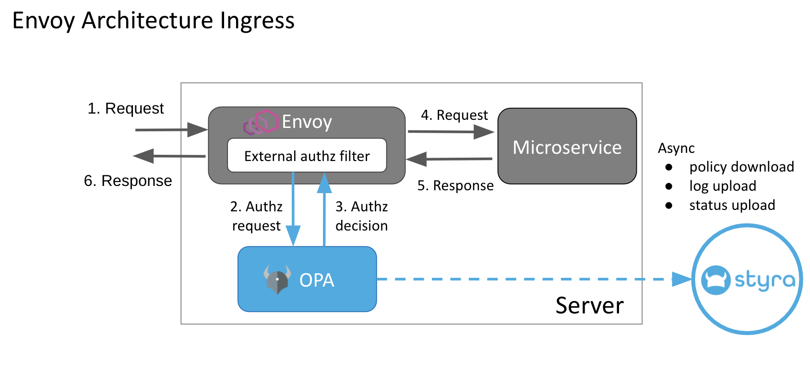

# Envoy

**Envoy** یک پروکسی لایه 7 (HTTP) و روتر متن‌باز است که برای مدیریت و نظارت بر ترافیک شبکه در معماری‌های میکروسرویس طراحی شده است. این ابزار به‌طور ویژه برای بهبود عملکرد، امنیت، و مقیاس‌پذیری سیستم‌های توزیع‌شده ساخته شده است. Envoy قابلیت‌های پیشرفته‌ای مانند مسیریابی پیچیده، کنترل ترافیک، مقیاس‌پذیری خودکار، نظارت و لاگ‌برداری جامع، و همچنین مدیریت تأخیر و خطاها را فراهم می‌آورد. از آنجا که Envoy به‌طور گسترده‌ای در محیط‌های میکروسرویس و سیستم‌های ابری استفاده می‌شود، به‌عنوان بخشی از سرویس‌های مشبک (Service Mesh) مانند Istio و Consul نیز به‌کار می‌رود و نقش کلیدی در مدیریت ارتباطات میکروسرویس‌ها ایفا می‌کند.

## اسکرین شات

در زیر یک تصویر از رابط کاربری Envoy آورده شده است:



### جهت اجرای Envoy با استفاده از Docker Compose، دستور زیر را وارد کنید:

```bash
sudo docker compose up -d
```


