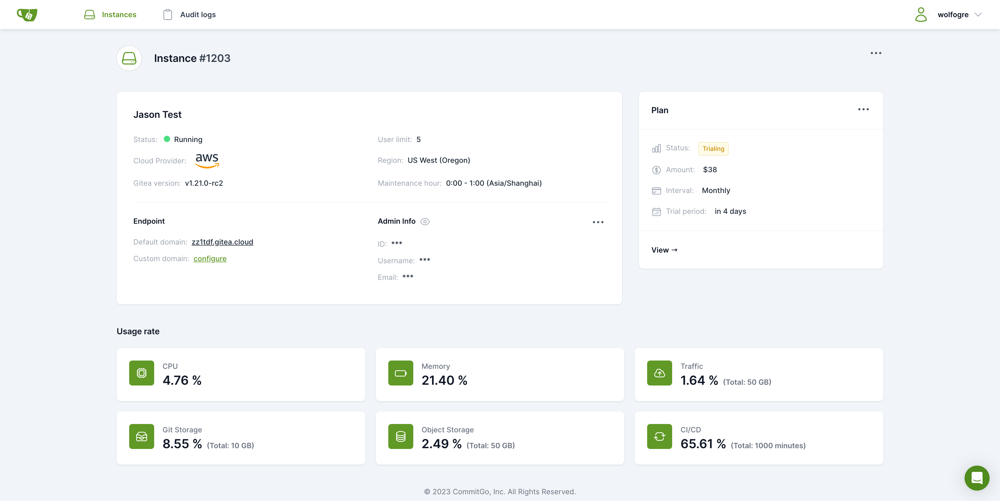

# Gitea

**Gitea** یک پلتفرم گیت متن‌باز و سبک برای میزبانی و مدیریت کد منبع است که به‌طور خاص برای خود میزبانی طراحی شده است. این ابزار امکاناتی مشابه به GitHub یا GitLab را در اختیار کاربران قرار می‌دهد، اما با حجم کمتر و نیاز به منابع سیستم پایین‌تر. Gitea از تمام ویژگی‌های اصلی گیت مانند کنترل نسخه، مدیریت مخزن‌ها (repositories)، بررسی کد، و مدیریت مسائل (issues) پشتیبانی می‌کند. این پلتفرم امکان ایجاد و مدیریت پروژه‌های نرم‌افزاری، همکاری تیمی و ادغام با CI/CD را به‌طور مؤثر فراهم می‌آورد. Gitea به‌راحتی نصب و پیکربندی می‌شود و می‌تواند به‌عنوان یک راه‌حل خود میزبان برای تیم‌های کوچک تا متوسط استفاده شود.

## اسکرین شات

در زیر یک تصویر از رابط کاربری Gitea آورده شده است:



### جهت اجرای Gitea با استفاده از Docker Compose، دستور زیر را وارد کنید:

```bash
sudo docker compose up -d
```

