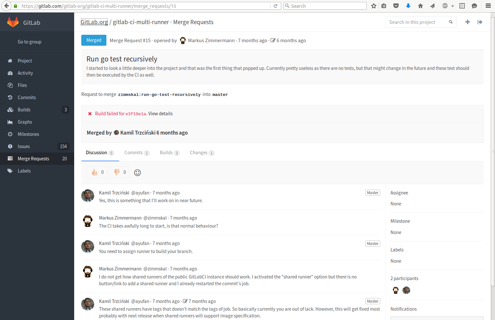

# GitLab

**GitLab** یک پلتفرم متن‌باز و کامل برای مدیریت کد منبع، توسعه نرم‌افزار و همکاری تیمی است که شامل ابزارهایی برای برنامه‌نویسی، تست، ادغام مداوم (CI)، تحویل مداوم (CD)، و مدیریت پروژه می‌شود. GitLab به توسعه‌دهندگان این امکان را می‌دهد تا کدهای خود را در یک محیط مرکزی ذخیره کنند، با تیم‌های خود به‌صورت همزمان همکاری کنند و فرآیندهای توسعه را به‌صورت خودکار و مداوم مدیریت کنند. از ویژگی‌های اصلی GitLab می‌توان به نسخه‌بندی کد، بررسی کد، گزارش باگ‌ها، و داشبوردهای تحلیلی برای ارزیابی عملکرد پروژه‌ها اشاره کرد. این پلتفرم می‌تواند به

## اسکرین شات

در زیر یک تصویر از رابط کاربری GitLab آورده شده است:



### جهت اجرای GitLab با استفاده از Docker Compose، دستور زیر را وارد کنید:

```bash
sudo docker compose up -d
```

