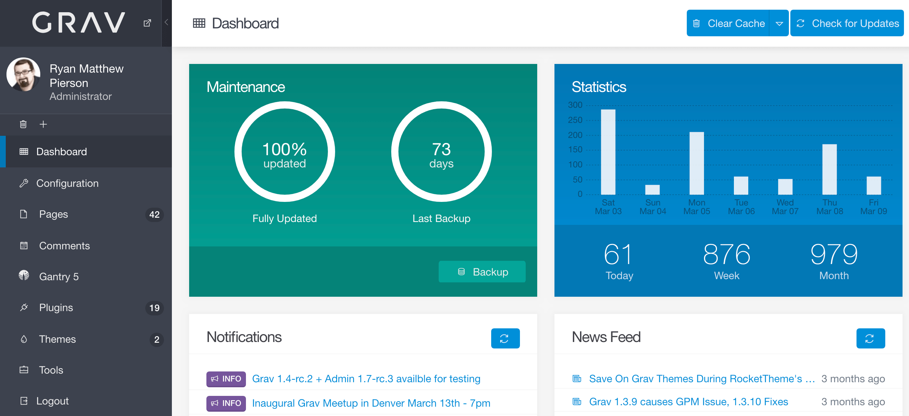

# Grav CMS

**Grav CMS** یک سیستم مدیریت محتوای متن‌باز و بدون پایگاه داده است که برای ساخت وب‌سایت‌های سریع، انعطاف‌پذیر و مقیاس‌پذیر طراحی شده است. برخلاف اکثر CMS‌ها که برای ذخیره‌سازی داده‌ها از پایگاه داده‌های رابطه‌ای استفاده می‌کنند، Grav از فایل‌های متنی برای ذخیره‌سازی محتوای وب‌سایت‌ها استفاده می‌کند، که این امر سرعت بالاتر و سادگی بیشتری در مدیریت محتوا را فراهم می‌آورد. Grav از یک ساختار فایل ساده و سیستم افزونه‌ها برای گسترش قابلیت‌ها استفاده می‌کند و به توسعه‌دهندگان این امکان را می‌دهد که بدون نیاز به دانش پایگاه داده، به راحتی سایت‌های پیچیده بسازند. از ویژگی‌های مهم Grav می‌توان به قابلیت پشتیبانی از قالب‌های سفارشی، سیستم مدیریت رسانه، و پشتیبانی از زبان‌های مختلف اشاره کرد. این CMS برای پروژه‌هایی که نیاز به انعطاف‌پذیری بالا، سرعت و مقیاس‌پذیری دارند، گزینه‌ای مناسب است.

## اسکرین شات

در زیر یک تصویر از رابط کاربری Grav CMS آورده شده است:



### جهت اجرای Grav CMS با استفاده از Docker Compose، دستور زیر را وارد کنید:

```bash
sudo docker compose up -d
```

