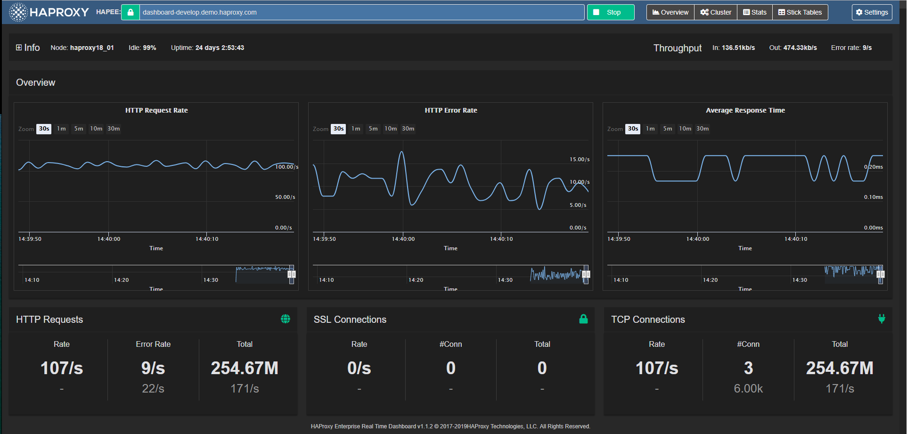

# HAProxy

**HAProxy** یک نرم‌افزار متن‌باز برای توازن بار (Load Balancing) و پراکسی معکوس (Reverse Proxy) است که برای توزیع ترافیک ورودی به چندین سرور هدف استفاده می‌شود. این ابزار معمولاً در معماری‌های مقیاس‌پذیر و با حجم ترافیک بالا به‌کار می‌رود تا بتواند درخواست‌ها را به‌صورت بهینه و بدون تأخیر بین سرورها تقسیم کند. HAProxy از پروتکل‌های مختلفی مانند HTTP, TCP و HTTPS پشتیبانی می‌کند و به مدیران سیستم این امکان را می‌دهد که ترافیک ورودی را بر اساس سیاست‌های مختلف، از جمله وضعیت سلامت سرورها، توزیع کنند. علاوه بر این، HAProxy قابلیت‌های پیشرفته‌ای مانند کشف خودکار سرورهای سالم، مدیریت جلسات (session persistence)، و ارتقاء امنیت با فیلتر کردن درخواست‌ها و جلوگیری از حملات مختلف را ارائه می‌دهد. به دلیل کارایی بالا و قابلیت پیکربندی پیشرفته، HAProxy به یکی از محبوب‌ترین گزینه‌ها برای مدیریت ترافیک در محیط‌های تولید تبدیل شده است.

## اسکرین شات

در زیر یک تصویر از رابط کاربری HAProxy آورده شده است:



### جهت اجرای HAProxy با استفاده از Docker Compose، دستور زیر را وارد کنید:

```bash
sudo docker compose up -d
```


لود بالانسر و پروکسی
