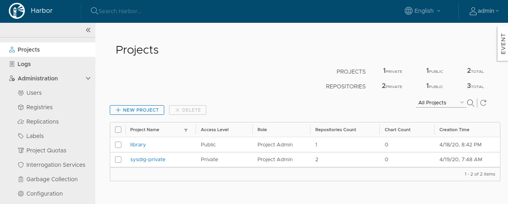

# Harbor

**Harbor** یک مخزن متن‌باز برای ذخیره و مدیریت تصاویر کانتینر است که به‌ویژه برای استفاده در محیط‌های تجاری و مقیاس‌پذیر طراحی شده است. این ابزار به کاربران این امکان را می‌دهد تا تصاویر داکر را به‌طور امن نگهداری کرده، آن‌ها را مدیریت کنند و در محیط‌های مختلف منتشر کنند. Harbor علاوه بر پشتیبانی از ذخیره‌سازی تصاویر داکر، قابلیت‌های پیشرفته‌ای مانند اسکن امنیتی تصاویر برای یافتن آسیب‌پذیری‌ها، کنترل دسترسی مبتنی بر نقش (RBAC)، مدیریت احراز هویت، و قابلیت پشتیبانی از چندین کاتالوگ و پروژه را فراهم می‌آورد. این ویژگی‌ها باعث می‌شود Harbor یک راه‌حل مناسب برای سازمان‌ها و تیم‌هایی باشد که به دنبال یک پلتفرم امن و مقیاس‌پذیر برای مدیریت تصاویر کانتینر هستند. Harbor همچنین از ویژگی‌هایی مانند کشف خودکار آسیب‌پذیری‌ها و یکپارچگی با سایر ابزارها مانند Trivy برای اسکن امنیتی پشتیبانی می‌کند.

**Trivy** یک ابزار متن‌باز برای اسکن آسیب‌پذیری‌ها در تصاویر کانتینر، کدهای منبع و فایل‌های سیستم است. این ابزار به‌طور ویژه برای شناسایی آسیب‌پذیری‌ها در لایه‌های مختلف تصاویر داکر طراحی شده است و می‌تواند به سرعت آسیب‌پذیری‌های موجود در بسته‌های نرم‌افزاری و کتابخانه‌ها را شناسایی کند. Trivy قادر است با اسکن کردن تصاویر کانتینر، پایگاه داده‌های مختلف، و حتی تنظیمات سیستم، مشکلات امنیتی را شناسایی کرده و گزارش‌هایی دقیق ارائه دهد. این ابزار از منابعی مانند پایگاه داده‌های CVE (Common Vulnerabilities and Exposures) برای شناسایی تهدیدات استفاده می‌کند. Trivy بسیار سریع، دقیق و ساده برای استفاده است، و به‌ویژه در فرایندهای CI/CD برای اطمینان از امنیت تصاویر کانتینر قبل از استقرار در محیط‌های تولید به‌کار می‌رود.

**Notary** یک سیستم امضای دیجیتال برای تصاویر کانتینر است که به‌طور خاص برای اطمینان از اصالت و یکپارچگی تصاویر کانتینر در اکوسیستم Docker و سایر پلتفرم‌ها طراحی شده است. با استفاده از Notary، توسعه‌دهندگان و تیم‌ها می‌توانند تصاویر داکر خود را قبل از انتشار یا استقرار، امضا کنند تا از تغییرات غیرمجاز یا آسیب‌پذیری‌های امنیتی جلوگیری کنند. این سیستم از استاندارد The Notary Protocol برای ایجاد و مدیریت امضاهای دیجیتال استفاده می‌کند و به کاربران اجازه می‌دهد تا اطمینان حاصل کنند که تنها تصاویر معتبر و بدون تغییر از منابع معتبر در محیط‌های تولید مستقر شوند. Notary به‌ویژه در محیط‌هایی که نیاز به امنیت بالا دارند، مانند سیستم‌های تولید حساس یا برای جلوگیری از حملات تزریق کانتینر، بسیار مفید است.

## اسکرین شات

در زیر یک تصویر از رابط کاربری Harbor آورده شده است:



### جهت اجرای Harbor با استفاده از Docker Compose، دستور زیر را وارد کنید:

```bash
sudo docker compose up -d
```
