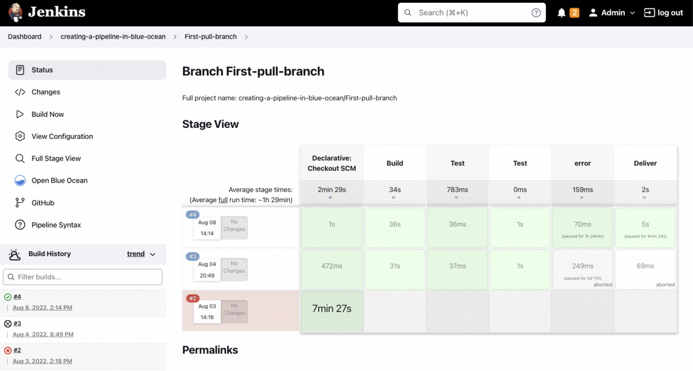

# Jenkins

**Jenkins** یک ابزار متن‌باز برای اتوماسیون فرآیندهای توسعه نرم‌افزار است که به‌ویژه در زمینه CI/CD (یکپارچگی مداوم و تحویل مداوم) کاربرد دارد. Jenkins به توسعه‌دهندگان این امکان را می‌دهد تا فرآیندهای ساخت، تست و استقرار نرم‌افزار را به‌صورت خودکار و بدون نیاز به دخالت دستی انجام دهند. این ابزار از طریق استفاده از Pipelineها، که شامل مجموعه‌ای از مراحل مختلف است، فرآیندهای پیچیده را به‌طور اتوماتیک مدیریت می‌کند. Jenkins از افزونه‌های متعدد برای یکپارچگی با سیستم‌های مختلف مانند Git, Docker, Kubernetes و سایر ابزارهای مدیریت پروژه پشتیبانی می‌کند. همچنین قابلیت مقیاس‌پذیری بالایی دارد و می‌توان آن را به‌راحتی در محیط‌های مختلف، از جمله محیط‌های ابری، مستقر کرد. Jenkins به‌عنوان یکی از محبوب‌ترین ابزارهای CI/CD در دنیای توسعه نرم‌افزار شناخته می‌شود و برای تیم‌ها و پروژه‌های بزرگ که نیاز به تست و استقرار خودکار دارند، بسیار مناسب است.

## اسکرین شات

در زیر یک تصویر از رابط کاربری Jenkins آورده شده است:



### جهت اجرای Jenkins با استفاده از Docker Compose، دستور زیر را وارد کنید:

```bash
sudo docker compose up -d
```
