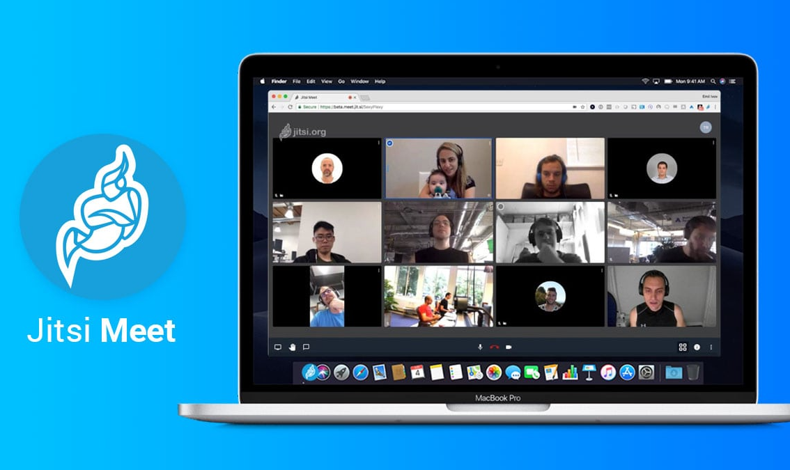

# Jitsi Meet

**Jitsi Meet** یک پلتفرم متن‌باز برای کنفرانس‌های ویدیویی است که به کاربران این امکان را می‌دهد تا جلسات ویدیویی را به‌صورت رایگان و بدون نیاز به ثبت‌نام یا نصب نرم‌افزار اضافی برگزار کنند. Jitsi Meet از فناوری‌های وب مانند WebRTC برای ارائه ویدیو، صوت و اشتراک‌گذاری صفحه به‌صورت همزمان استفاده می‌کند. این پلتفرم ویژگی‌هایی مانند رمزگذاری سرتاسری (end-to-end encryption)، پشتیبانی از جلسات گروهی، ضبط جلسات، اشتراک‌گذاری اسناد و قابلیت یکپارچگی با سرویس‌های دیگر مانند Google Calendar را دارا است. Jitsi Meet به‌طور ویژه برای تیم‌ها و سازمان‌هایی که نیاز به برگزاری جلسات آنلاین امن و مقیاس‌پذیر دارند، بسیار مناسب است و می‌تواند به‌راحتی بر روی سرورهای خود میزبان (self-hosted) یا از طریق سرویس‌های ابری مستقر شود.

## اسکرین شات

در زیر یک تصویر از رابط کاربری Jitsi Meet آورده شده است:



### جهت اجرای Jitsi Meet با استفاده از Docker Compose، دستور زیر را وارد کنید:

```bash
sudo docker compose up -d
```


تماس تصویری متن‌باز
