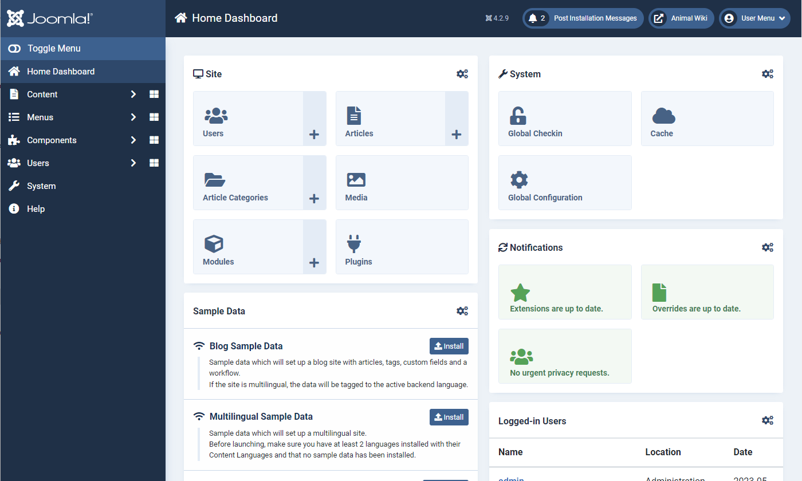

# Joomla

**Joomla** یک سیستم مدیریت محتوای متن‌باز (CMS) است که به کاربران این امکان را می‌دهد تا وب‌سایت‌ها و برنامه‌های وب پویا و پیچیده بسازند. Joomla با رابط کاربری ساده و در عین حال قدرتمند خود، برای ساخت سایت‌هایی با امکانات متنوع مانند فروشگاه‌های آنلاین، وب‌سایت‌های خبری، انجمن‌ها و وبلاگ‌ها مناسب است. این CMS از افزونه‌ها و قالب‌های سفارشی پشتیبانی می‌کند که به کاربران امکان می‌دهد سایت خود را به‌راحتی سفارشی کرده و ویژگی‌های جدید اضافه کنند. Joomla دارای سیستم مدیریت کاربر پیشرفته، امکانات جستجو و SEO بهینه، و قابلیت چندزبانه بودن است که آن را برای سازمان‌ها و کسب‌وکارهایی که نیاز به یک پلتفرم مقیاس‌پذیر دارند، مناسب می‌سازد.

## اسکرین شات

در زیر یک تصویر از رابط کاربری Joomla آورده شده است:



### جهت اجرای Joomla با استفاده از Docker Compose، دستور زیر را وارد کنید:

```bash
sudo docker compose up -d
```

