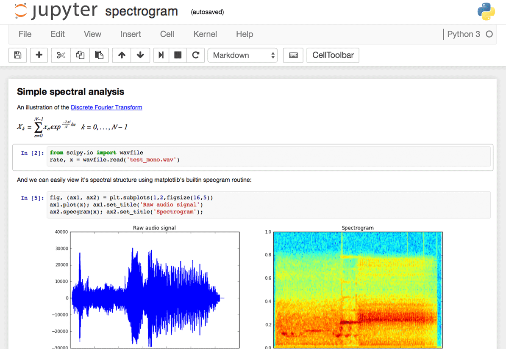

# Jupyter

**Jupyter** یک محیط محاسباتی متن‌باز است که به‌ویژه برای تحلیل داده‌ها، برنامه‌نویسی علمی، و یادگیری ماشین طراحی شده است. این ابزار به کاربران این امکان را می‌دهد که کدهای پایتون و سایر زبان‌ها را در قالب "notebook"های تعاملی بنویسند و اجرا کنند، به‌طوری که می‌توانند کد، توضیحات متنی، نمودارها و تصاویر را به‌طور همزمان در یک سند مشاهده کنند. Jupyter از زبان‌های مختلفی مانند Python، R و Julia پشتیبانی می‌کند و امکان تحلیل داده‌ها، مدل‌سازی و یادگیری ماشین را به‌طور ساده و بصری فراهم می‌آورد. این ابزار به‌ویژه در تحقیق‌های علمی، تحلیل داده‌ها و پروژه‌های تحلیلی که نیاز به مستندسازی فرآیندها و نتایج دارند، محبوب است. همچنین، Jupyter می‌تواند در محیط‌های ابری و به‌صورت همکاری تیمی استفاده شود تا به پژوهشگران و تیم‌ها این امکان را بدهد که به‌صورت تعاملی و گروهی بر روی داده‌ها کار کنند.

## اسکرین شات

در زیر یک تصویر از رابط کاربری Jupyter آورده شده است:



### جهت اجرای Jupyter با استفاده از Docker Compose، دستور زیر را وارد کنید:

```bash
sudo docker compose up -d
```

