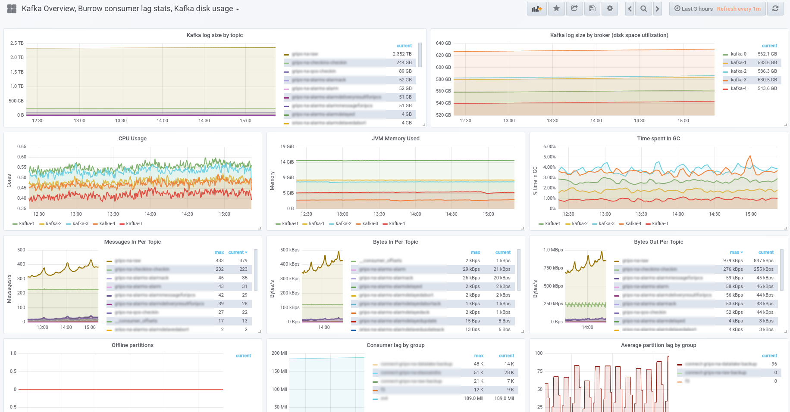

# Apache Kafka

**Apache Kafka** یک سیستم توزیع‌شده برای پردازش و انتقال داده‌ها به‌صورت جریان (streaming) است که به‌ویژه برای مدیریت حجم بالای داده‌ها در زمان واقعی طراحی شده است. Kafka به‌عنوان یک سیستم پیام‌رسان (message broker) عمل می‌کند و به برنامه‌ها این امکان را می‌دهد که داده‌ها را به‌صورت توزیع‌شده، پایدار و با مقیاس‌پذیری بالا ارسال و دریافت کنند. این ابزار برای پردازش داده‌های بزرگ، تحلیل زمان واقعی، و استفاده در سیستم‌های میکروسرویسی ایده‌آل است. Kafka داده‌ها را در قالب پیام‌هایی به نام "topic" ذخیره کرده و می‌تواند به‌طور موازی و با سرعت بالا، داده‌ها را به مصرف‌کنندگان مختلف ارسال کند. Kafka از ویژگی‌هایی مانند تحمل خطا، مقیاس‌پذیری افقی، و پردازش توزیع‌شده پشتیبانی می‌کند، که آن را به گزینه‌ای مناسب برای سیستم‌های بزرگ و پیچیده تبدیل کرده است. این پلتفرم به‌ویژه در محیط‌های پردازش داده‌های حجیم، مانند تجزیه و تحلیل زمان واقعی و سیستم‌های توصیه‌گر، کاربرد زیادی دارد.

## اسکرین شات

در زیر یک تصویر از رابط کاربری Apache Kafka آورده شده است:



### جهت اجرای Apache Kafka با استفاده از Docker Compose، دستور زیر را وارد کنید:

```bash
sudo docker compose up -d
```

