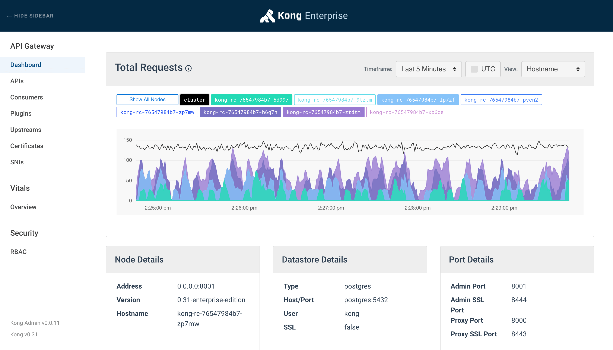

# Kong

**Kong** یک پلتفرم مدیریت API متن‌باز است که به‌طور ویژه برای مدیریت ترافیک ورودی به سرویس‌ها و میکروسرویس‌ها طراحی شده است. این ابزار به‌عنوان یک API Gateway عمل می‌کند و امکان مدیریت، نظارت، امنیت و مقیاس‌پذیری API‌ها را فراهم می‌آورد. Kong از قابلیت‌هایی مانند احراز هویت، نظارت بر ترافیک، مسیریابی درخواست‌ها، محدودیت تعداد درخواست‌ها (rate limiting)، و فیلترینگ درخواست‌ها پشتیبانی می‌کند. این پلتفرم بر اساس معماری مقیاس‌پذیر و توزیع‌شده طراحی شده و می‌تواند به‌راحتی با سایر ابزارهای مدیریت میکروسرویس‌ها مانند Kubernetes و Docker یکپارچه شود. Kong از پلاگین‌های مختلف پشتیبانی می‌کند که امکان افزودن ویژگی‌های سفارشی به API Gateway را فراهم می‌آورد. به‌طور کلی، Kong برای سازمان‌هایی که به دنبال مدیریت و محافظت از API‌ها در معماری‌های میکروسرویسی هستند، یک راه‌حل قدرتمند و انعطاف‌پذیر است.

## اسکرین شات

در زیر یک تصویر از رابط کاربری Kong آورده شده است:



### جهت اجرای Kong با استفاده از Docker Compose، دستور زیر را وارد کنید:

```bash
sudo docker compose up -d
```


