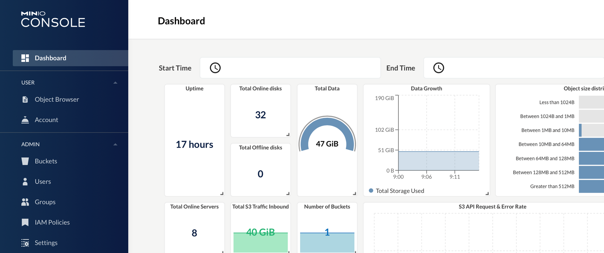

# MinIO

**MinIO** یک سیستم ذخیره‌سازی ابری متن‌باز است که به‌طور کامل با پروتکل Amazon S3 سازگار است و برای ذخیره و مدیریت داده‌های غیرساختاریافته (مانند تصاویر، ویدیوها و فایل‌های بزرگ) طراحی شده است. MinIO به‌ویژه برای استفاده در محیط‌های مقیاس‌پذیر، مانند محیط‌های Docker و Kubernetes، بهینه‌سازی شده و می‌تواند به‌عنوان یک جایگزین سبک و سریع برای سیستم‌های ذخیره‌سازی ابری مانند Amazon S3 استفاده شود. این ابزار از معماری توزیع‌شده و مقیاس‌پذیر پشتیبانی می‌کند و امکان ذخیره‌سازی و دسترسی به داده‌ها را در مقیاس‌های بسیار بزرگ فراهم می‌آورد. MinIO همچنین از ویژگی‌های امنیتی مانند رمزگذاری داده‌ها، احراز هویت و مجوزهای دسترسی پیشرفته پشتیبانی می‌کند و قابلیت‌های مانند بارگذاری موازی و مدیریت ساده داده‌ها را در اختیار کاربران قرار می‌دهد. این سیستم برای شرکت‌ها و توسعه‌دهندگانی که به دنبال یک راه‌حل ذخیره‌سازی ابری با عملکرد بالا و انعطاف‌پذیری زیاد هستند، گزینه‌ای بسیار مناسب است.

## اسکرین شات

در زیر یک تصویر از رابط کاربری MinIO آورده شده است:



### جهت اجرای MinIO با استفاده از Docker Compose، دستور زیر را وارد کنید:

```bash
sudo docker compose up -d
```

