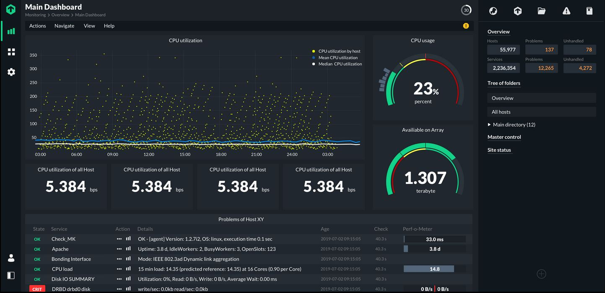

# Nagios

**Nagios** یک ابزار نظارتی قدرتمند و متن‌باز است که برای نظارت بر وضعیت سرورها، شبکه‌ها و خدمات IT مورد استفاده قرار می‌گیرد. این ابزار به مدیران سیستم کمک می‌کند تا به‌صورت مداوم عملکرد سیستم‌های مختلف را بررسی کرده و در صورت بروز مشکل یا خرابی در سیستم‌ها، به‌صورت فوری هشدارهایی ارسال شود. Nagios از سیستم‌های هشداردهی مختلف پشتیبانی می‌کند و قابلیت سفارشی‌سازی زیادی برای نظارت بر انواع تجهیزات و سرویس‌ها دارد. همچنین، این ابزار قابلیت گسترش با استفاده از افزونه‌ها و اسکریپت‌های مختلف را دارد و می‌تواند به‌طور مؤثر در مدیریت و بهبود عملکرد زیرساخت‌های IT در سازمان‌ها کمک کند.

## اسکرین شات

در زیر یک تصویر از رابط کاربری Nagios آورده شده است:



### جهت اجرای Nagios با استفاده از Docker Compose، دستور زیر را وارد کنید:

```bash
sudo docker compose up -d
```


