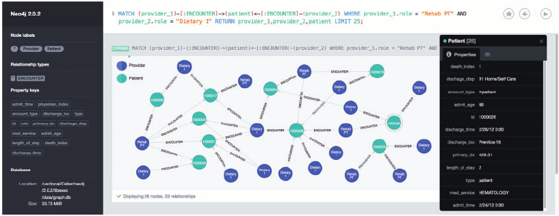

# Neo4j

**Neo4j** یک پایگاه داده گرافی متن‌باز است که برای ذخیره‌سازی و پردازش داده‌ها به‌صورت گرافی طراحی شده است. برخلاف پایگاه‌های داده رابطه‌ای که داده‌ها را در جداول ذخیره می‌کنند، Neo4j داده‌ها را به‌صورت گراف، شامل گره‌ها (nodes)، روابط (relationships)، و ویژگی‌ها (properties) ذخیره می‌کند. این نوع ساختار ذخیره‌سازی به‌ویژه برای مدل‌سازی روابط پیچیده و داده‌های متصل، مانند شبکه‌های اجتماعی، تحلیل‌های مسیر، و گراف‌های وابستگی مناسب است. Neo4j از زبان پرس‌وجوی Cypher برای انجام عملیات مختلف مانند جستجو، فیلتر کردن و تحلیل داده‌ها استفاده می‌کند. این پایگاه داده گرافی بسیار سریع و مقیاس‌پذیر است و به‌طور گسترده در کاربردهایی مانند تحلیل شبکه‌های اجتماعی، سیستم‌های توصیه‌گر، و کشف تقلب در صنایع مختلف استفاده می‌شود. Neo4j با ویژگی‌هایی مانند مقیاس‌پذیری افقی، پردازش تراکنش‌های پیچیده و قابلیت یکپارچگی با سایر سیستم‌ها، یک راه‌حل قدرتمند برای مدیریت و تحلیل داده‌های پیچیده است.

## اسکرین شات

در زیر یک تصویر از رابط کاربری Neo4j آورده شده است:



### جهت اجرای Neo4j با استفاده از Docker Compose، دستور زیر را وارد کنید:

```bash
sudo docker compose up -d
```

