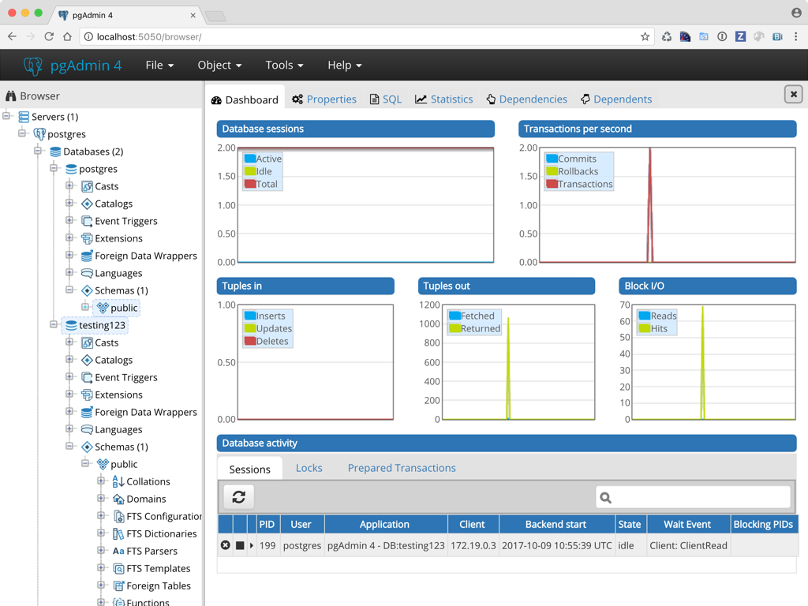

# pgAdmin

**pgAdmin** یک ابزار مدیریت گرافیکی برای پایگاه داده PostgreSQL است که به‌طور گسترده برای نظارت، مدیریت و طراحی پایگاه‌های داده PostgreSQL استفاده می‌شود. این ابزار امکاناتی مانند ایجاد و مدیریت جداول، نمایش داده‌ها، نوشتن و اجرای پرس‌وجوهای SQL، پشتیبان‌گیری و بازیابی داده‌ها، و مدیریت دسترسی‌ها و کاربران را در اختیار مدیران پایگاه داده قرار می‌دهد. pgAdmin از یک رابط کاربری گرافیکی ساده و قدرتمند بهره می‌برد که به کاربران این امکان را می‌دهد تا به راحتی با پایگاه داده PostgreSQL تعامل داشته باشند. علاوه بر نسخه دسکتاپ، pgAdmin نسخه وب نیز دارد که می‌تواند از هر مرورگری به پایگاه داده متصل شود. این ابزار به‌ویژه برای توسعه‌دهندگان، مدیران سیستم و پایگاه داده‌ها که نیاز به یک ابزار کاربرپسند و کاربردی برای مدیریت پایگاه‌های داده PostgreSQL دارند، بسیار مناسب است.

**PostgreSQL** یک سیستم مدیریت پایگاه داده رابطه‌ای (RDBMS) متن‌باز و قدرتمند است که برای ذخیره‌سازی، پردازش و مدیریت داده‌های پیچیده طراحی شده است. این پایگاه داده از SQL استاندارد برای انجام عملیات‌های مختلف مانند جستجو، ذخیره‌سازی و دستکاری داده‌ها استفاده می‌کند و به‌دلیل انعطاف‌پذیری بالا، قابلیت گسترش و پشتیبانی از انواع داده‌ها، از جمله داده‌های ساختاریافته و نیمه‌ساختاریافته، شناخته می‌شود. PostgreSQL از ویژگی‌هایی مانند پشتیبانی از تراکنش‌های ACID، قفل‌گذاری سطرها، سیستم‌های پارتیشن‌بندی داده‌ها، و قابلیت نوشتن توابع ذخیره‌شده و افزونه‌ها بهره می‌برد. این سیستم برای پروژه‌های کوچک تا سازمان‌های بزرگ که نیاز به مدیریت داده‌های پیچیده و مقیاس‌پذیر دارند، مناسب است و به‌طور گسترده در صنعت‌های مختلف مانند بانکداری، تجارت الکترونیک و تحلیل داده‌های بزرگ استفاده می‌شود.

**TimescaleDB** یک افزونه متن‌باز برای PostgreSQL است که به‌طور خاص برای ذخیره‌سازی و پردازش داده‌های زمانی (time-series data) طراحی شده است. این افزونه با بهبود عملکرد PostgreSQL، امکان مدیریت حجم بالای داده‌هایی که به‌طور پیوسته در طول زمان تولید می‌شوند، مانند داده‌های سنسور‌ها، ترافیک شبکه و اطلاعات مالی را فراهم می‌کند. TimescaleDB از پارتیشن‌بندی خودکار برای ذخیره‌سازی کارآمد داده‌ها استفاده کرده و قابلیت مقیاس‌پذیری بالا را ارائه می‌دهد. این ابزار به توسعه‌دهندگان این امکان را می‌دهد که از قابلیت‌های پیشرفته PostgreSQL بهره‌برداری کرده و به‌طور مؤثر داده‌های زمانی را تجزیه و تحلیل کنند.

**PostGIS** یک افزونه برای PostgreSQL است که قابلیت‌های پردازش داده‌های جغرافیایی و مکانی را به این پایگاه داده اضافه می‌کند. این ابزار به PostgreSQL اجازه می‌دهد تا داده‌های جغرافیایی مانند مختصات نقاط، خطوط و اشکال هندسی را ذخیره و پردازش کند. PostGIS به‌طور گسترده در کاربردهای مرتبط با سامانه‌های اطلاعات جغرافیایی (GIS)، نقشه‌برداری، تحلیل‌های مکانی، و موقعیت‌یابی استفاده می‌شود. این افزونه از استانداردهای OGC (Open Geospatial Consortium) پیروی کرده و توابعی برای پردازش، جستجو و تحلیل داده‌های مکانی مانند فاصله، تقاطع، و قرارگیری اشیاء در نواحی خاص را فراهم می‌کند. PostGIS برای توسعه‌دهندگانی که به داده‌های جغرافیایی و مکانی نیاز دارند، مانند پروژه‌های نقشه‌سازی، تحلیل داده‌های جغرافیایی و مدیریت منابع طبیعی، یک راه‌حل قدرتمند و مقیاس‌پذیر است.

## اسکرین شات

در زیر یک تصویر از رابط کاربری pgAdmin آورده شده است:



### جهت اجرای pgAdmin با استفاده از Docker Compose، دستور زیر را وارد کنید:

```bash
sudo docker compose up -d
```

