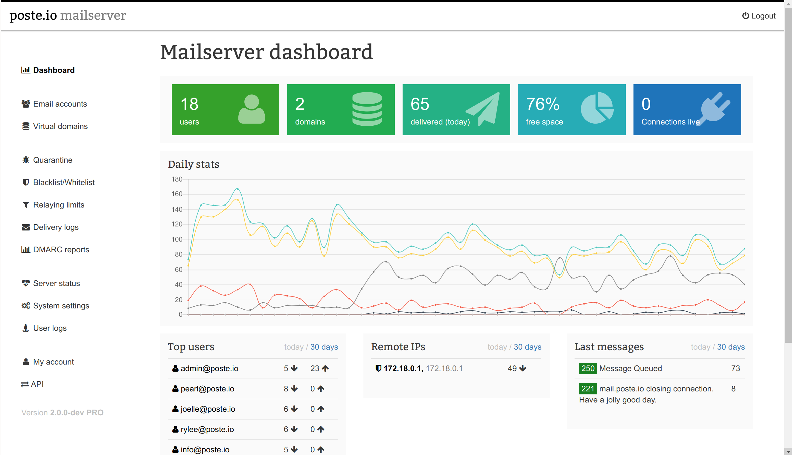

# Poste.io

**Poste.io** یک سرویس ایمیل متن‌باز و خودمیزبان است که به کاربران امکان می‌دهد تا سرور ایمیل خود را به راحتی با استفاده از Docker راه‌اندازی و مدیریت کنند. این سرویس شامل تمام امکانات مورد نیاز برای یک سرویس ایمیل حرفه‌ای است، از جمله پشتیبانی از پروتکل‌های SMTP، IMAP و POP3، وب‌میل (Webmail)، فیلتر اسپم، و احراز هویت دو مرحله‌ای. Poste.io به‌طور خاص برای کسانی طراحی شده است که به دنبال راه‌اندازی سرور ایمیل خود هستند و می‌خواهند کنترل کاملی بر داده‌های خود داشته باشند. این ابزار به دلیل نصب ساده و قابلیت پیکربندی آسان، برای استفاده در محیط‌های شخصی و سازمانی ایده‌آل است.

## اسکرین شات

در زیر یک تصویر از رابط کاربری Poste.io آورده شده است:



### جهت اجرای Poste.io با استفاده از Docker Compose، دستور زیر را وارد کنید:

```bash
sudo docker compose up -d
```


