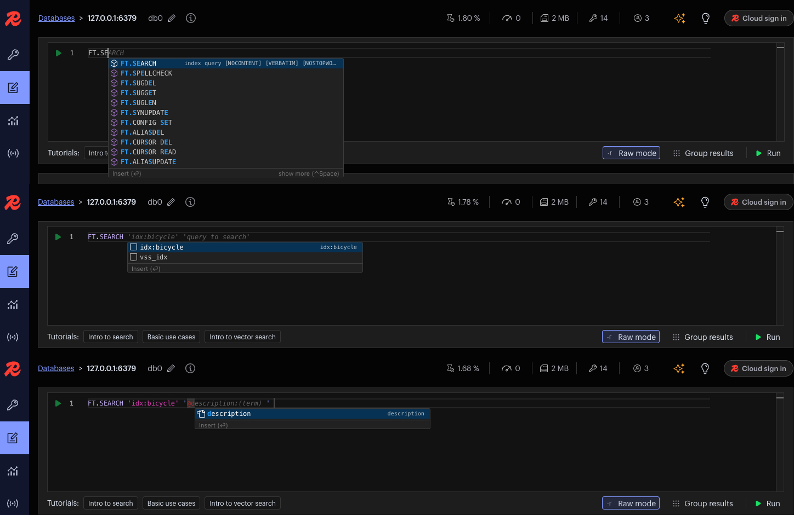

# RedisInsight

**RedisInsight** یک ابزار گرافیکی رایگان و رسمی برای مدیریت، تجزیه و تحلیل و نظارت بر پایگاه داده‌های Redis است. این ابزار توسط Redis Labs توسعه داده شده و به کاربران این امکان را می‌دهد که به‌طور بصری با داده‌های Redis خود تعامل داشته باشند. RedisInsight ویژگی‌هایی مانند مرور داده‌ها، جستجو و ویرایش کلیدها، مشاهده و تجزیه‌و‌تحلیل پرفورمنس و مصرف حافظه، و پشتیبانی از داده‌های پیچیده مانند انواع داده‌ها و ساختارهای مختلف Redis (لیست‌ها، مجموعه‌ها، هش‌ها و غیره) را فراهم می‌کند. همچنین، RedisInsight امکان نظارت بر سرورهای Redis از جمله اطلاعات مربوط به سلامت و عملکرد، ترافیک و خطاها را به‌صورت بصری و راحت فراهم می‌آورد. این ابزار به‌ویژه برای توسعه‌دهندگان و مدیران سیستم که به دنبال یک راه‌حل ساده و کاربردی برای مدیریت و بهینه‌سازی Redis هستند، بسیار مفید است.

**Redis** یک پایگاه داده کلید-مقدار (Key-Value) سریع و متن‌باز است که به‌طور ویژه برای ذخیره‌سازی داده‌های موقتی و حافظه‌محور طراحی شده است. این سیستم برای مدیریت داده‌هایی با دسترسی بسیار سریع، مانند کشینگ، صف‌ها، و داده‌های جلسه (sessions) استفاده می‌شود. Redis از ساختارهای داده‌ای پیچیده مانند رشته‌ها، لیست‌ها، مجموعه‌ها، هش‌ها، و حتی انواع جغرافیایی و زمان‌بندی شده پشتیبانی می‌کند و به‌طور گسترده در برنامه‌های مقیاس‌پذیر و با عملکرد بالا، مانند تحلیل‌های بلادرنگ، ذخیره‌سازی داده‌های کش‌شده، و سیستم‌های پیام‌رسان، استفاده می‌شود. Redis قابلیت‌هایی مانند پشتیبانی از تراکنش‌ها، مدل‌های pub/sub (انتشار/اشتراک)، و ذخیره‌سازی داده‌ها به‌صورت دایرکتوری‌ها (persistent) را ارائه می‌دهد. به دلیل سرعت بالای خواندن و نوشتن و قابلیت مقیاس‌پذیری بالا، Redis یکی از محبوب‌ترین سیستم‌های پایگاه داده در میان توسعه‌دهندگان است.

## اسکرین شات

در زیر یک تصویر از رابط کاربری RedisInsight آورده شده است:



### جهت اجرای RedisInsight با استفاده از Docker Compose، دستور زیر را وارد کنید:

```bash
sudo docker compose up -d
```


