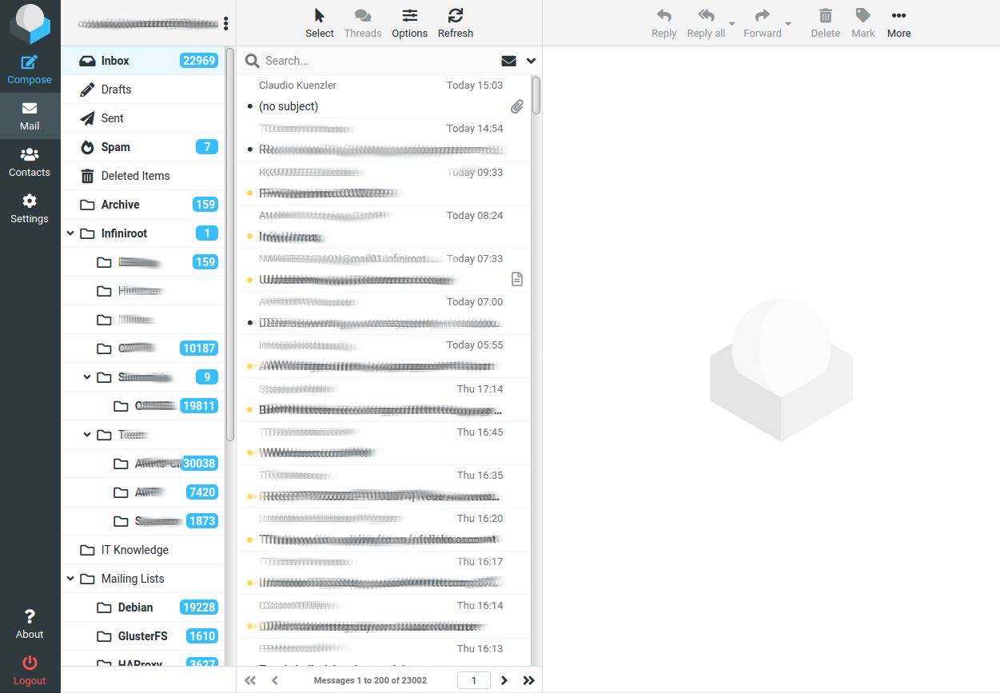

# Roundcube

**Roundcube** یک وب‌میل (webmail) متن‌باز است که برای دسترسی به ایمیل‌ها از طریق مرورگر طراحی شده است. این پلتفرم رابط کاربری ساده و کاربرپسندی دارد و از پروتکل‌های استاندارد ایمیل مانند IMAP و SMTP پشتیبانی می‌کند. Roundcube به کاربران این امکان را می‌دهد که ایمیل‌های خود را ارسال،

## اسکرین شات

در زیر یک تصویر از رابط کاربری Roundcube آورده شده است:



### جهت اجرای Roundcube با استفاده از Docker Compose، دستور زیر را وارد کنید:

```bash
sudo docker compose up -d
```


