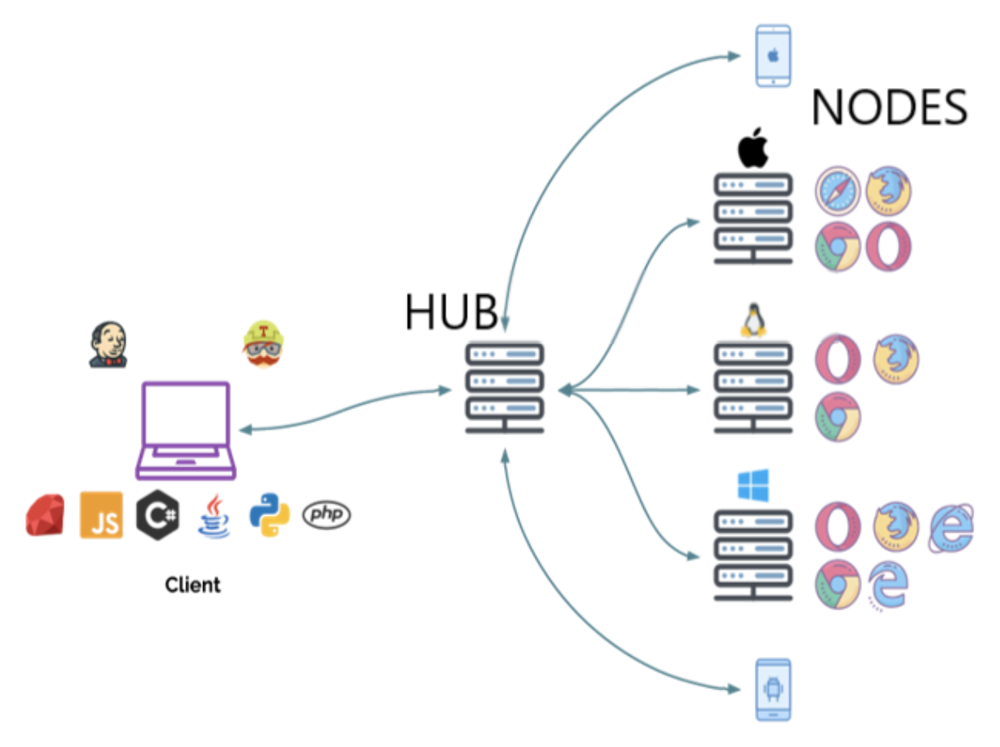

# Selenium

**Selenium** یک ابزار متن‌باز برای خودکارسازی مرورگرهای وب است که به توسعه‌دهندگان این امکان را می‌دهد تا تست‌های خودکار برای برنامه‌های وب ایجاد کنند. با استفاده از Selenium، می‌توان تست‌های پیچیده‌ای برای تعامل با المان‌های صفحه وب مانند کلیک‌ها، ورود اطلاعات، و بررسی وضعیت المان‌ها نوشت. این ابزار از زبان‌های برنامه‌نویسی مختلف مانند Java، Python، C# و JavaScript پشتیبانی می‌کند و به‌طور گسترده برای تست در مرورگرهای مختلف نظیر Chrome، Firefox و Safari استفاده می‌شود. Selenium به تیم‌های توسعه کمک می‌کند تا تست‌های قابل تکرار و مقیاس‌پذیر ایجاد کرده و فرآیندهای تست خود را در CI/CD اتوماتیک کنند.

## اسکرین شات

در زیر یک تصویر از رابط کاربری Selenium آورده شده است:



### جهت اجرای Selenium با استفاده از Docker Compose، دستور زیر را وارد کنید:

```bash
sudo docker compose up -d
```

