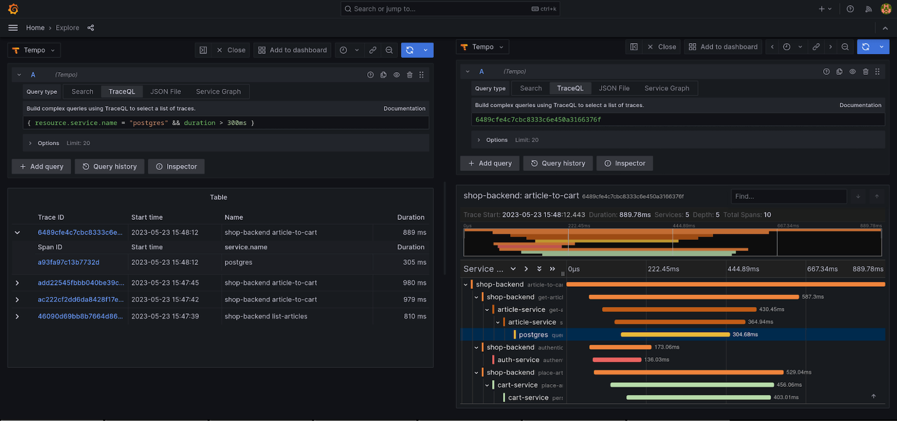

# Tempo

**Tempo** یک سیستم نظارت و ردیابی توزیع‌شده است که به‌طور خاص برای جمع‌آوری و تجزیه و تحلیل داده‌های ردیابی (Tracing) در معماری‌های میکروسرویسی طراحی شده است. این ابزار به شما کمک می‌کند تا رفتار و عملکرد سیستم‌های پیچیده‌ای که از سرویس‌های مختلف تشکیل شده‌اند را مشاهده و تجزیه‌و‌تحلیل کنید. Tempo به‌عنوان یک راه‌حل مقیاس‌پذیر و کارآمد برای ذخیره‌سازی داده‌های ردیابی و گزارش‌های مرتبط با تراکنش‌های میکروسرویسی استفاده می‌شود و به تیم‌های توسعه کمک می‌کند تا مشکلات عملکردی را شناسایی و رفع کنند. این سیستم می‌تواند به‌طور یکپارچه با ابزارهای دیگری مانند Prometheus و Grafana برای ایجاد یک پایگاه نظارتی کامل در معماری‌های مدرن ترکیب شود. Tempo به‌ویژه برای تحلیل و ردیابی درخواست‌های توزیع‌شده در مقیاس‌های بالا و محیط‌های ابری مفید است.

## اسکرین شات

در زیر یک تصویر از رابط کاربری Watchtower آورده شده است:



### جهت اجرای Tempo با استفاده از Docker Compose، دستور زیر را وارد کنید:

```bash
sudo docker compose up -d
```

