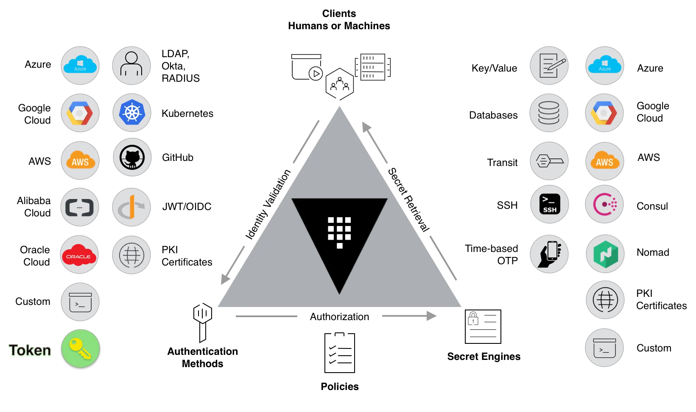

# HashiCorp Vault

**HashiCorp Vault** یک ابزار متن‌باز برای مدیریت امن اطلاعات حساس مانند رمزهای عبور، کلیدهای API، گواهینامه‌ها و داده‌های رمزگذاری‌شده است. این ابزار به سازمان‌ها کمک می‌کند تا داده‌های حساس خود را به‌صورت مرکزی ذخیره و دسترسی به آن‌ها را به‌طور دقیق کنترل کنند. Vault با استفاده از روش‌های پیشرفته رمزگذاری، اطمینان حاصل می‌کند که داده‌ها در هنگام ذخیره‌سازی و انتقال ایمن هستند. این ابزار قابلیت‌هایی مانند مدیریت کلیدهای رمزنگاری، احراز هویت چندمنظوره (مانند LDAP، Kubernetes، و AWS)، و نظارت بر دسترسی‌ها را فراهم می‌آورد. همچنین، Vault امکان مدیریت و تمدید خودکار گواهینامه‌های SSL/TLS را نیز دارد.

## اسکرین شات

در زیر یک تصویر از رابط کاربری HashiCorp Vault آورده شده است:



### جهت اجرای HashiCorp Vault با استفاده از Docker Compose، دستور زیر را وارد کنید:

```bash
sudo docker compose up -d
```

