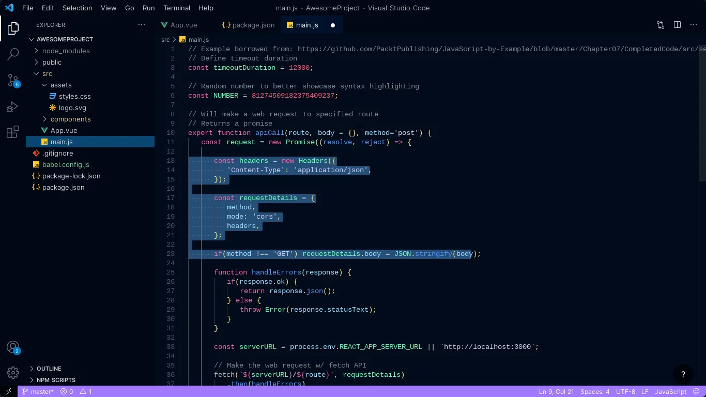

# Visual Studio Code

**Visual Studio Code (VSCode)** یک محیط توسعه یکپارچه (IDE) و ویرایشگر کد متن‌باز است که توسط شرکت مایکروسافت توسعه داده شده است. این ابزار برای برنامه‌نویسان و توسعه‌دهندگان نرم‌افزار در زبان‌های مختلف مانند JavaScript، Python، Java، C++، و بسیاری دیگر طراحی شده است. VSCode به‌دلیل رابط کاربری ساده، سرعت بالا و قابلیت‌های توسعه‌دهی بسیار، به یکی از محبوب‌ترین ویرایشگرهای کد تبدیل شده است. از ویژگی‌های برجسته آن می‌توان به تکمیل خودکار کد، خطایابی (debugging)، پشتیبانی از افزونه‌ها (extensions)، کنترل نسخه با Git، و قابلیت‌های سفارشی‌سازی اشاره کرد. همچنین، VSCode از طریق افزونه‌ها قابلیت گسترش به ابزارهای مختلفی مانند Docker، Kubernetes، و زبان‌های مختلف برنامه‌نویسی را دارد. به دلیل امکانات پیشرفته و سهولت استفاده، VSCode به‌طور گسترده در پروژه‌های فردی، تیمی و حتی سازمان‌های بزرگ به‌عنوان ابزار اصلی توسعه نرم‌افزار استفاده می‌شود.

## اسکرین شات

در زیر یک تصویر از رابط کاربری Visual Studio Code آورده شده است:



### جهت اجرای Visual Studio Code با استفاده از Docker Compose، دستور زیر را وارد کنید:

```bash
sudo docker compose up -d
```


