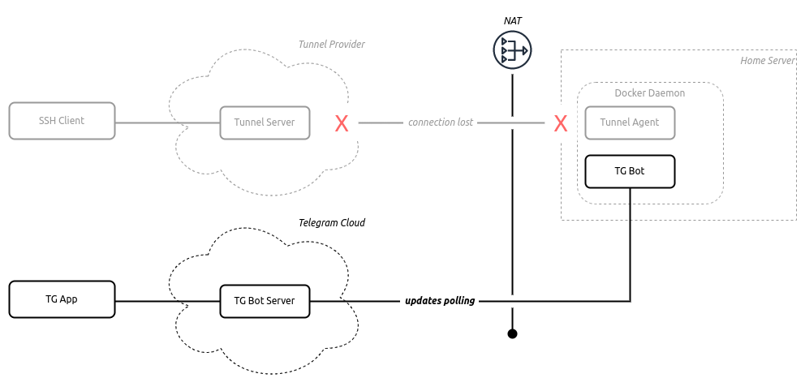

# Telegram Bot API

**Telegram Bot API** یک رابط کاربری ساده برای توسعه‌دهندگان است تا بتوانند بات‌های تلگرامی بسازند. با استفاده از این API می‌توانید از تمام قابلیت‌های تلگرام مانند ارسال پیام‌ها، دریافت پیام‌ها، مدیریت گروه‌ها و کانال‌ها، و سایر امکانات تلگرام استفاده کنید. نصب Telegram Bot API به‌طور خودکار با استفاده از Docker و Docker Compose می‌تواند راحت‌تر و سریع‌تر انجام شود.


## اسکرین شات

در زیر یک تصویر از رابط کاربری Telegram Bot API آورده شده است:



### جهت اجرای Telegram Bot API با استفاده از Docker Compose، دستور زیر را وارد کنید:

```bash
sudo docker compose up -d
```


