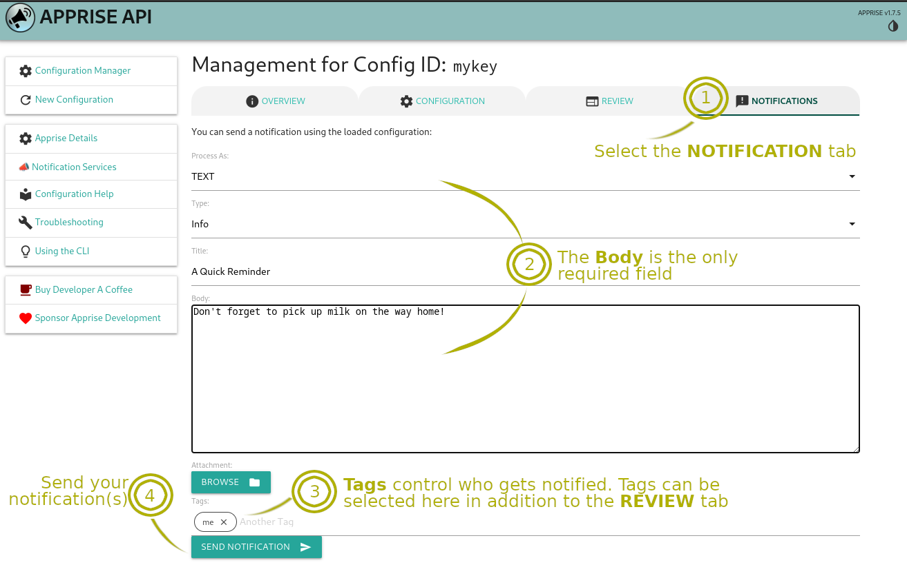

# Apprise API

**Apprise API** یک پلتفرم متن‌باز برای ارسال اعلان‌ها و هشدارهای سیستم است که به کاربران این امکان را می‌دهد تا پیام‌های خود را از طریق سرویس‌های مختلف پیام‌رسانی مانند ایمیل، پیامک، Telegram، Discord، Slack، و بسیاری دیگر ارسال کنند. این API از انواع پروتکل‌ها و سرویس‌ها پشتیبانی می‌کند و به‌طور خاص برای کاربران و توسعه‌دهندگان طراحی شده است تا بتوانند اعلان‌ها و هشدارها را به‌راحتی از طریق یک رابط یکپارچه ارسال کنند.

## ویژگی‌های Apprise API:
- پشتیبانی از پروتکل‌های مختلف: Apprise از پروتکل‌هایی مثل SMTP (ایمیل)، HTTP (وب‌هوک‌ها)، Telegram, Slack, Discord، و ... برای ارسال اعلان‌ها پشتیبانی می‌کند.

- سادگی استفاده: این API ساده و انعطاف‌پذیر است و به کاربران اجازه می‌دهد تا به‌راحتی اعلان‌های خود را با یکپارچگی کامل و از طریق کانال‌های مختلف ارسال کنند.

- پشتیبانی از فرمت‌های مختلف پیام: کاربران می‌توانند پیام‌های خود را در قالب‌های مختلف ارسال کنند، از جمله متن، HTML، یا حتی تصاویر و فایل‌های پیوست.

- قابلیت سفارشی‌سازی: این ابزار به توسعه‌دهندگان این امکان را می‌دهد که سیستم اعلان خود را سفارشی کرده و به‌طور دقیق نیازهای خود را برآورده کنند.

- Apprise به‌ویژه در پروژه‌هایی که نیاز به ارسال پیام‌های هشدار، گزارش، یا اعلان‌های سیستم در چندین کانال مختلف دارند، مفید است.

## اسکرین شات

در زیر یک تصویر از رابط کاربری Apprise API آورده شده است:



### جهت اجرای Apprise API با استفاده از Docker Compose، دستور زیر را وارد کنید:

```bash
sudo docker compose up -d
```


