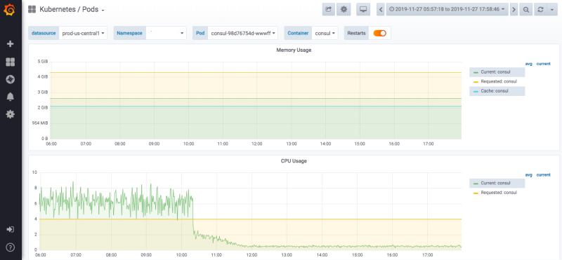

# HashiCorp Consul

**HashiCorp Consul** یک ابزار متن‌باز برای مدیریت سرویس‌ها و کشف سرویس‌ها در محیط‌های توزیع‌شده است. این ابزار به‌ویژه برای مدیریت پیکربندی، کشف خودکار سرویس‌ها، و تنظیمات شبکه‌های میکروسرویس‌ها طراحی شده است. Consul قابلیت‌های متنوعی مانند ذخیره‌سازی پیکربندی، احراز هویت، و کنترل دسترسی را فراهم می‌آورد. یکی از ویژگی‌های برجسته Consul، سیستم کشف سرویس آن است که به سرویس‌ها این امکان را می‌دهد تا به‌طور خودکار یکدیگر را پیدا کرده و با یکدیگر ارتباط برقرار کنند. علاوه بر این، Consul از ویژگی‌های امنیتی مانند رمزگذاری داده‌ها و احراز هویت برای ارتباطات بین سرویس‌ها پشتیبانی می‌کند. این ابزار به‌ویژه در معماری‌های میکروسرویسی و سیستم‌های توزیع‌شده که نیاز به مقیاس‌پذیری، انعطاف‌پذیری و مدیریت پیچیده دارند، کاربرد دارد.

## اسکرین شات

در زیر یک تصویر از رابط کاربری HashiCorp Consul آورده شده است:



### جهت اجرای HashiCorp Consul با استفاده از Docker Compose، دستور زیر را وارد کنید:

```bash
sudo docker compose up -d
```


