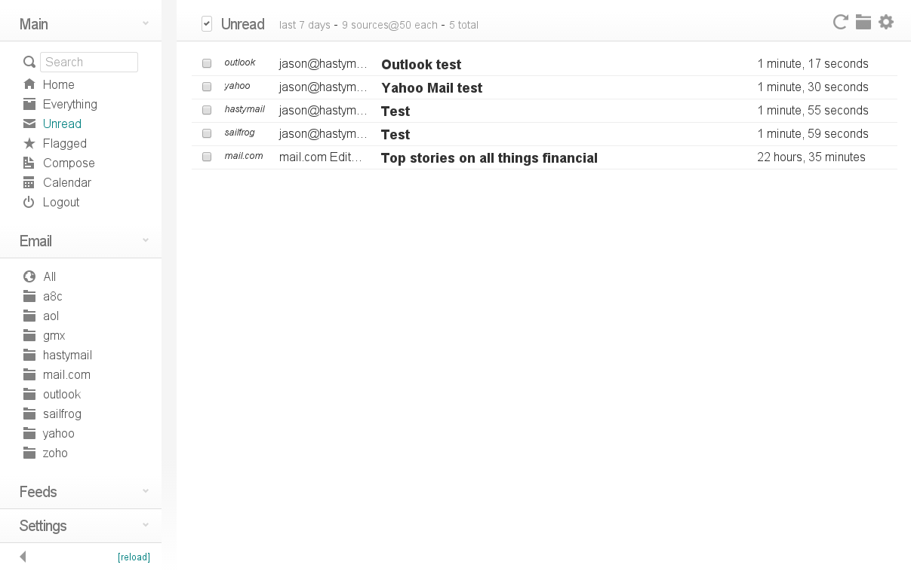

# Cypht

**Watchtower** یک اپلیکیشن متن‌باز و ساده برای مدیریت ایمیل است که هدف آن فراهم آوردن یک رابط کاربری سریع و کاربرپسند برای دسترسی به ایمیل‌ها از سرویس‌های مختلف است. این ابزار به کاربران اجازه می‌دهد که ایمیل‌های خود را از چندین حساب ایمیل (مانند Gmail، Yahoo، و IMAP/SMTP دیگر) در یک مکان واحد مشاهده و مدیریت کنند. Cypht به‌عنوان یک کلاینت ایمیل مبتنی بر وب، از قابلیت‌های اصلی نظیر جستجوی پیشرفته ایمیل‌ها، فیلتر کردن پیام‌ها، و استفاده از چندین حساب به‌طور همزمان پشتیبانی می‌کند. این ابزار به‌ویژه برای کسانی که به دنبال یک راه‌حل ساده و سریع برای مدیریت چندین حساب ایمیل بدون پیچیدگی‌های اضافی هستند، مناسب است. Cypht همچنین دارای ویژگی‌های امنیتی مانند رمزگذاری و احراز هویت برای محافظت از داده‌های کاربران است.

## اسکرین شات

در زیر یک تصویر از رابط کاربری Cypht آورده شده است:



### جهت اجرای Cypht با استفاده از Docker Compose، دستور زیر را وارد کنید:

```bash
sudo docker compose up -d
```

