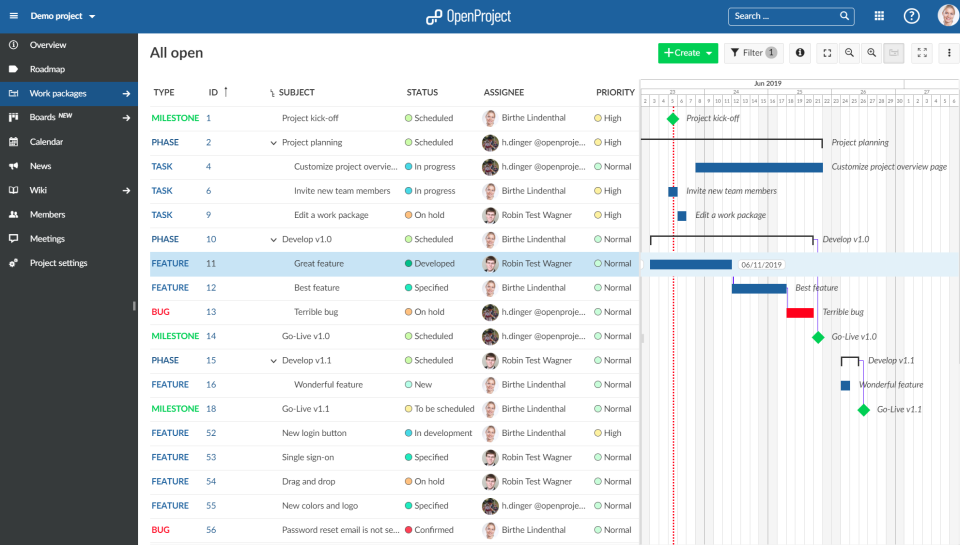

# OpenProject

**OpenProject** یک ابزار مدیریت پروژه متن‌باز است که برای تیم‌ها و سازمان‌ها طراحی شده تا به‌طور مؤثری پروژه‌ها، وظایف و منابع را مدیریت کنند. این نرم‌افزار قابلیت‌های جامعی برای برنامه‌ریزی، پیگیری پیشرفت، مدیریت وظایف، و همکاری تیمی ارائه می‌دهد. OpenProject با رابط کاربری ساده و کاربرپسند خود، استفاده از آن را برای اعضای تیم در هر سطحی از تجربه راحت می‌کند. همچنین، این پلتفرم از اسکرام و کانبان پشتیبانی می‌کند و به‌ویژه برای تیم‌های چابک (Agile) و سازمان‌های نیازمند مدیریت پیچیده پروژه‌ها مناسب است. علاوه بر این، OpenProject از قابلیت‌های مختلفی برای مستندسازی، ردیابی زمان، و مدیریت منابع برخوردار است که امکان انجام پروژه‌ها را در مهلت‌های زمانی مشخص فراهم می‌کند.

از امکانات کلیدی OpenProject می‌توان به مدیریت پروژه‌ها و وظایف، زمان‌بندی پروژه‌ها، داشبورد تحلیلی پیشرفته، ردیابی باگ‌ها، همکاری تیمی و مدیریت منابع اشاره کرد. این ابزار امکان تعریف مایل‌استون‌ها، تعیین اولویت‌ها و ایجاد گزارش‌های پیشرفته برای تحلیل وضعیت پروژه‌ها را فراهم می‌آورد. OpenProject از امکانات مختلفی مانند پشتیبانی از اسکرام، کانبان، و روش‌های چابک برای مدیریت وظایف استفاده می‌کند و قابلیت‌های شخصی‌سازی متعددی دارد. همچنین، این ابزار از راه‌های ارتباطی مختلفی مانند پیغام‌ها و اعلان‌ها پشتیبانی می‌کند و می‌تواند به‌راحتی با سایر ابزارهای موجود از طریق API و پلاگین‌ها یکپارچه شود. این ویژگی‌ها OpenProject را به ابزاری ایده‌آل برای تیم‌ها و شرکت‌هایی تبدیل می‌کند که به‌دنبال یک راهکار کامل برای مدیریت پروژه‌های خود هستند.

## اسکرین شات

در زیر یک تصویر از رابط کاربری OpenProject آورده شده است:



### جهت اجرای OpenProject با استفاده از Docker Compose، دستور زیر را وارد کنید:

```bash
sudo docker compose up -d
```


