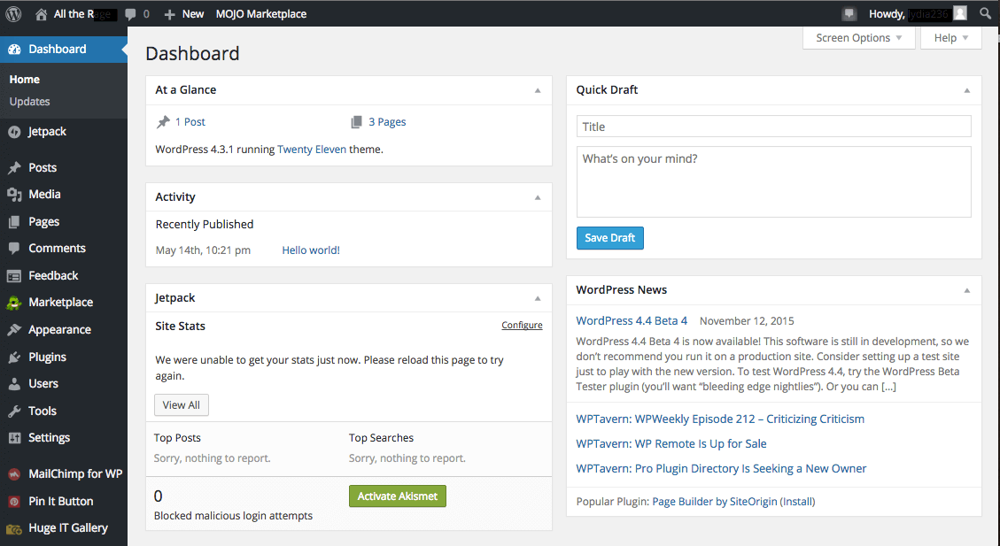

# WordPress

**WordPress** یک سیستم مدیریت محتوا (CMS) متن‌باز و رایگان است که برای ایجاد و مدیریت وب‌سایت‌ها و وبلاگ‌ها استفاده می‌شود. این پلتفرم با بیش از 40 درصد از وب‌سایت‌های موجود در اینترنت، یکی از محبوب‌ترین و پرکاربردترین ابزارهای ساخت وب‌سایت در دنیا است. WordPress به‌دلیل رابط کاربری ساده و قابلیت سفارشی‌سازی بالا، به‌ویژه برای افرادی که تجربه فنی کمتری دارند، بسیار جذاب است. این سیستم از افزونه‌ها (plugins) و قالب‌ها (themes) پشتیبانی می‌کند که امکان افزودن ویژگی‌های جدید و تغییر ظاهر سایت را بدون نیاز به نوشتن کد فراهم می‌آورد. علاوه بر این، WordPress به‌طور مداوم به‌روزرسانی می‌شود و جامعه بزرگی از توسعه‌دهندگان و طراحان فعال دارد که به گسترش آن کمک می‌کنند.

## اسکرین شات

در زیر یک تصویر از رابط کاربری WordPress آورده شده است:



### جهت اجرای WordPress با استفاده از Docker Compose، دستور زیر را وارد کنید:

```bash
sudo docker compose up -d
```
