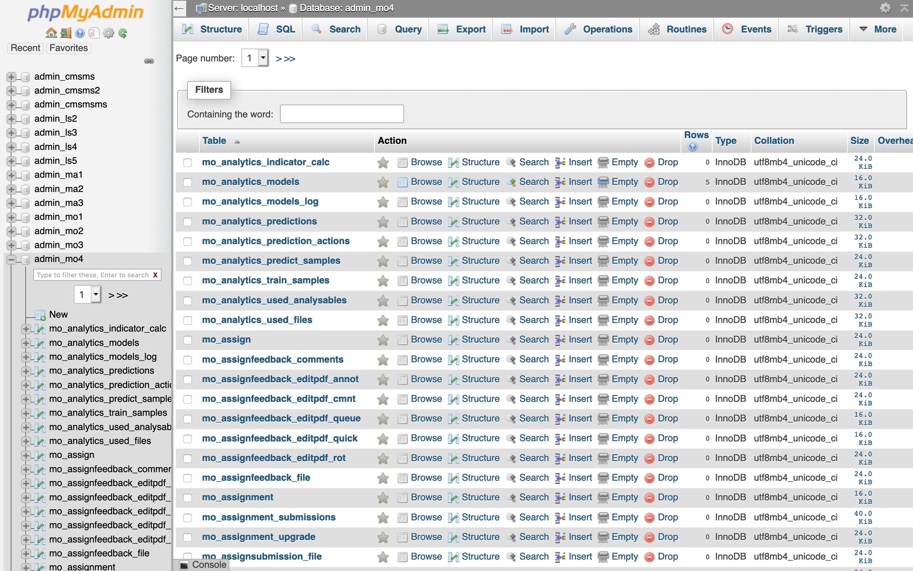

# phpMyAdmin

**phpMyAdmin** یک ابزار مدیریت پایگاه داده‌ MySQL و MariaDB است که به‌صورت وب‌پایه عمل می‌کند و به کاربران این امکان را می‌دهد تا پایگاه‌های داده خود را از طریق مرورگر وب مدیریت کنند. این ابزار محبوب و کاربرپسند، به راحتی به شما این امکان را می‌دهد که جداول، رکوردها، کوئری‌ها و دیگر ویژگی‌های پایگاه داده را بدون نیاز به خط فرمان مدیریت کنید. phpMyAdmin امکانات زیادی را فراهم می‌کند، از جمله قابلیت مدیریت کاربران، وارد و صادر کردن داده‌ها، ایجاد و ویرایش جداول، اجرای دستورات SQL و مشاهده گزارش‌های مربوط به پایگاه داده. با رابط کاربری ساده و قابل‌فهم، phpMyAdmin به‌ویژه برای توسعه‌دهندگان و مدیران پایگاه داده‌هایی که با MySQL یا MariaDB کار می‌کنند، ابزاری بسیار مفید و پرکاربرد است. این ابزار به‌راحتی قابل نصب است و از بیشتر سیستم‌های عامل مانند لینوکس، ویندوز و macOS پشتیبانی می‌کند.

## اسکرین شات

در زیر یک تصویر از رابط کاربری phpMyAdmin آورده شده است:



### جهت اجرای phpMyAdmin با استفاده از Docker Compose، دستور زیر را وارد کنید:

```bash
sudo docker compose up -d
```
