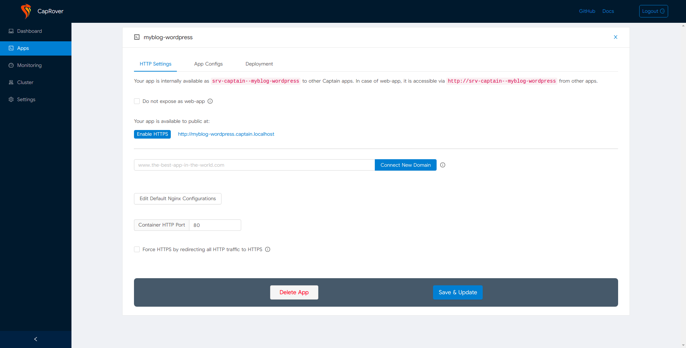

# CapRover

**CapRover** یک پلتفرم متن‌باز برای استقرار و مدیریت اپلیکیشن‌های وب است که روی Docker و Kubernetes اجرا می‌شود. این ابزار به توسعه‌دهندگان این امکان را می‌دهد که به راحتی اپلیکیشن‌های خود را به صورت خودکار روی سرورهای مختلف مستقر کنند، بدون اینکه نیاز به پیکربندی پیچیده یا آشنایی با مفاهیم پیچیده کلاسترینگ داشته باشند. CapRover به واسطه رابط کاربری وبی که دارد، امکان مدیریت سرویس‌ها و دیتابیس‌ها را برای توسعه‌دهندگان بسیار ساده کرده است. همچنین از Docker Compose پشتیبانی می‌کند و می‌تواند با استفاده از روش‌های مختلف مانند CI/CD به‌طور خودکار اپلیکیشن‌ها را به روز رسانی کند. به طور کلی، CapRover ابزاری عالی برای کسانی است که به دنبال راه‌حل ساده و مقیاس‌پذیر برای استقرار و مدیریت اپلیکیشن‌های میکروسرویس در محیط‌های داکری هستند.

## اسکرین شات

در زیر یک تصویر از رابط کاربری CapRover آورده شده است:



### جهت اجرای CapRover با استفاده از Docker Compose، دستور زیر را وارد کنید:

```bash
sudo docker compose up -d
```

