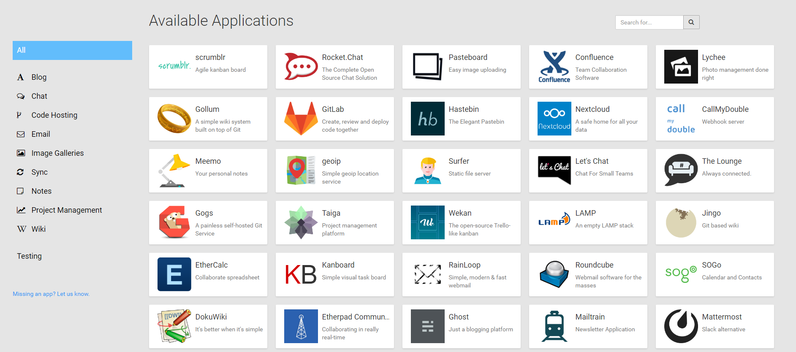

# Cloudron

**Cloudron** یک پلتفرم متن‌باز است که برای استقرار، مدیریت و مقیاس‌بندی اپلیکیشن‌های وب روی سرورهای خصوصی طراحی شده است. این پلتفرم به صورت خودکار مدیریت وابستگی‌ها، به‌روزرسانی‌ها، پشتیبان‌گیری و امنیت را برای اپلیکیشن‌ها فراهم می‌کند و به کاربران این امکان را می‌دهد که به راحتی اپلیکیشن‌های مختلفی مانند CMS‌ها، پایگاه‌های داده، و ابزارهای همکاری را بر روی سرورهای خود نصب کنند. Cloudron با رابط کاربری ساده و کاربرپسندی که دارد، فرآیند نصب و مدیریت اپلیکیشن‌ها را به طور چشمگیری تسهیل می‌کند و از Docker برای ایزوله‌سازی و اجرای اپلیکیشن‌ها استفاده می‌کند. این پلتفرم همچنین از سیستم‌های احراز هویت مرکزی، نظارت بر پایداری، و پشتیبانی از SSL خودکار برخوردار است، که تمامی این ویژگی‌ها آن را به یک انتخاب مناسب برای کسب‌وکارها و تیم‌های توسعه‌ای که نیاز به استقرار سریع و مدیریت آسان دارند، تبدیل می‌کند.

## اسکرین شات

در زیر یک تصویر از رابط کاربری Cloudron آورده شده است:



### جهت اجرای Cloudron با استفاده از Docker Compose، دستور زیر را وارد کنید:

```bash
sudo docker compose up -d
```

