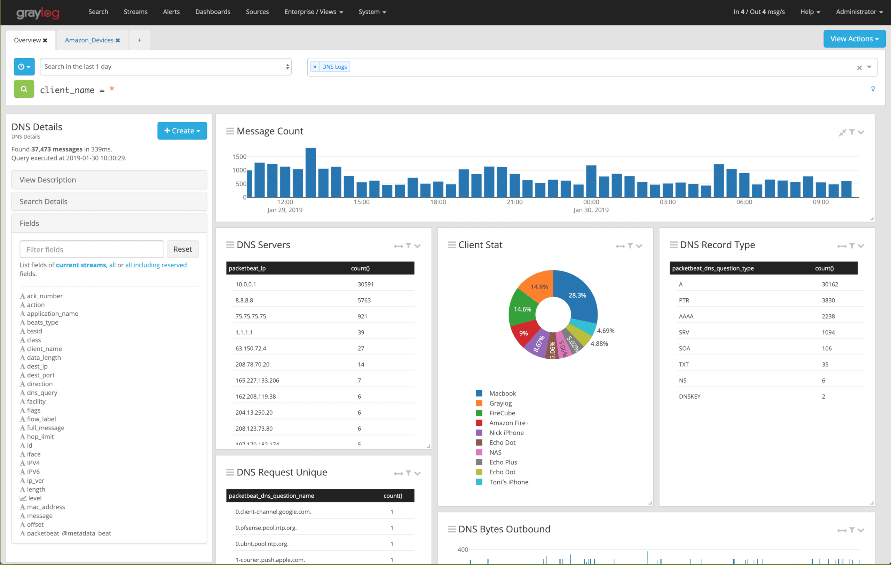

# Graylog

**Graylog** یک پلتفرم منبع باز برای مدیریت و تحلیل لاگ‌ها است که به سازمان‌ها کمک می‌کند تا داده‌های لاگ تولید شده توسط سرورها، اپلیکیشن‌ها و سرویس‌ها را جمع‌آوری، ذخیره و تجزیه و تحلیل کنند. این سیستم به‌ویژه برای محیط‌های پیچیده و توزیع‌شده طراحی شده و به کاربران این امکان را می‌دهد که لاگ‌ها را از منابع مختلف مانند سرورهای Linux، Windows، کانتینرها و سایر سرویس‌ها جمع‌آوری کنند. Graylog دارای یک رابط کاربری گرافیکی (GUI) است که جستجوی پیشرفته، فیلتر کردن، و ایجاد داشبوردهای سفارشی را امکان‌پذیر می‌سازد. همچنین این ابزار از قابلیت‌هایی مانند هشداردهی، تجزیه و تحلیل زمان واقعی، و تجسم داده‌ها پشتیبانی می‌کند، که آن را به ابزاری ایده‌آل برای نظارت بر سیستم‌ها و یافتن مشکلات در زمان‌های بحرانی تبدیل می‌کند. Graylog با استفاده از Elasticsearch برای ذخیره‌سازی و پردازش داده‌ها و MongoDB برای مدیریت متاداده‌ها، مقیاس‌پذیری و عملکرد بالایی را ارائه می‌دهد.

### نحوه استفاده در PHP
```bash
composer require graylog2/gelf-php
```
```php
require 'vendor/autoload.php';

use Gelf\Message;
use Gelf\Publisher;
use Gelf\Transport\TcpTransport;

// پیکربندی اتصال به Graylog
$publisher = new Publisher();
$transport = new TcpTransport('graylog_server_ip', 12201); // آدرس و پورت Graylog
$publisher->addTransport($transport);

// ساختن پیام لاگ
$message = new Message();
$message->setShortMessage('This is a test log')
        ->setFullMessage('This is a more detailed log message')
        ->setTimestamp(time())
        ->setLevel(Message::INFO);

// ارسال پیام به Graylog
$publisher->publish($message);

echo "Log sent to Graylog.";
```

### نحوه استفاده در Python
```bash
pip install graypy
```
```python
import logging
import graypy

# ایجاد یک logger
logger = logging.getLogger('my_logger')
logger.setLevel(logging.DEBUG)

# تنظیم ارسال لاگ‌ها به Graylog
handler = graypy.GELFUDPHandler('graylog_server_ip', 12201)  # آدرس و پورت Graylog
logger.addHandler(handler)

# ارسال لاگ‌ها
logger.debug('This is a debug log')
logger.info('This is an info log')
logger.error('This is an error log')
```

### نحوه استفاده در React / Vue
```bash
npm install gelf-javascript
```
```javascript
import gelf from 'gelf-javascript';

// پیکربندی Gelf برای ارسال به Graylog
gelf.init({
  "host": "graylog_server_ip", // آدرس سرور Graylog
  "port": 12201, // پورت مربوطه
  "protocol": "udp", // پروتکل UDP یا TCP
  "facility": "my-app-logs" // نام اپلیکیشن شما
});

// ارسال لاگ
gelf.info('Log message', { extra: 'value' });
gelf.error('Error message', { details: 'Some details' });
```


## اسکرین شات

در زیر یک تصویر از رابط کاربری Graylog آورده شده است:



### جهت اجرای Graylog با استفاده از Docker Compose، دستور زیر را وارد کنید:

```bash
sudo docker compose up -d
```


