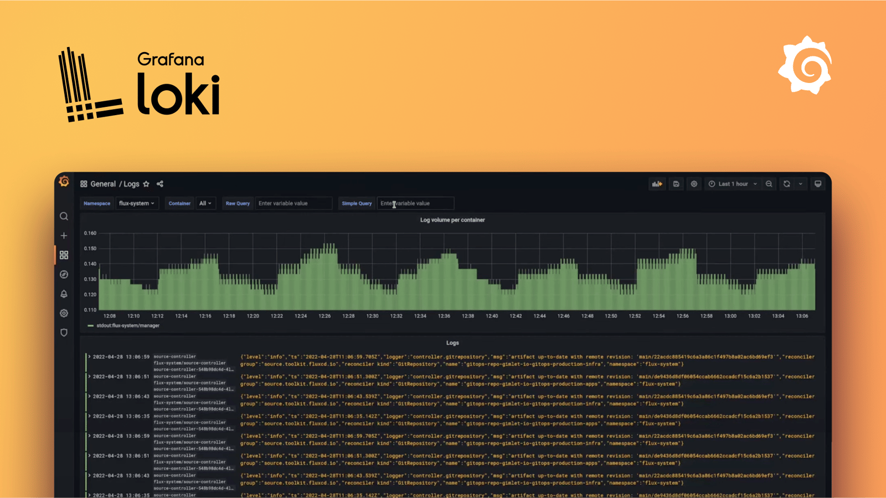

# Loki

**Loki** یک سیستم مدیریت لاگ سبک و مقیاس‌پذیر است که توسط شرکت Grafana Labs توسعه یافته است. این سیستم مشابه Prometheus برای مانیتورینگ، به طور خاص برای ذخیره‌سازی و تجزیه‌وتحلیل لاگ‌ها طراحی شده است. Loki برخلاف سیستم‌های لاگ سنتی که به طور پیش‌فرض لاگ‌ها را از منابع مختلف ذخیره و ایندکس می‌کنند، تنها اطلاعات متا (مانند برچسب‌ها و منابع) را ایندکس می‌کند و خود لاگ‌ها را به صورت فشرده ذخیره می‌کند. این رویکرد به کاهش هزینه‌های ذخیره‌سازی و افزایش کارایی در مقیاس بزرگ کمک می‌کند. Loki به راحتی با Grafana یکپارچه می‌شود و امکان جستجوی سریع و نمایش بصری لاگ‌ها را فراهم می‌آورد. این ابزار برای برنامه‌های میکروسرویس‌محور و محیط‌های کانتینری مانند Kubernetes بسیار مناسب است و از قابلیت‌هایی مانند پردازش بلادرنگ لاگ‌ها و جستجو با استفاده از برچسب‌ها پشتیبانی می‌کند.

## اسکرین شات

در زیر یک تصویر از رابط کاربری Loki آورده شده است:



### جهت اجرای Loki با استفاده از Docker Compose، دستور زیر را وارد کنید:

```bash
sudo docker compose up -d
```


