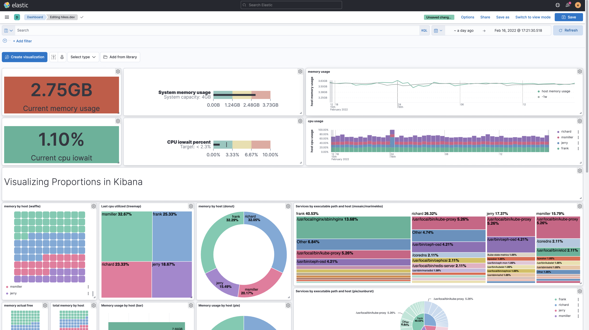

# Elasticsearch, Kibana, Logstash

**Elasticsearch, Kibana, Logstash** (که به‌طور کلی به نام ELK Stack شناخته می‌شود) یک مجموعه قدرتمند از ابزارهای منبع باز هستند که به‌طور عمده برای مدیریت و تجزیه و تحلیل لاگ‌ها، داده‌ها و متریک‌ها استفاده می‌شوند. 

**Elasticsearch** یک موتور جستجو و تجزیه و تحلیل است که برای ذخیره‌سازی و جستجو در داده‌های بزرگ بهینه شده است. این ابزار از جستجوی متن آزاد، فیلترهای پیچیده و تجزیه و تحلیل‌های سریع پشتیبانی می‌کند و داده‌ها را به‌صورت ساختاریافته و قابل جستجو ذخیره می‌کند. 

**Logstash** ابزاری است که برای جمع‌آوری، پردازش و انتقال داده‌ها از منابع مختلف به *Elasticsearch* به کار می‌رود. این ابزار قابلیت پردازش داده‌ها را با استفاده از فیلترها و انکودرهای مختلف فراهم می‌کند تا داده‌ها به شکل مورد نظر برای ذخیره‌سازی و تحلیل آماده شوند.

**Kibana** یک رابط کاربری وب است که به شما این امکان را می‌دهد تا داده‌های ذخیره‌شده در *Elasticsearch* را به‌صورت بصری مشاهده و تجزیه و تحلیل کنید. *Kibana* به کاربران این امکان را می‌دهد که داشبوردهای سفارشی بسازند، نمودارها و گراف‌ها را برای تحلیل داده‌ها نمایش دهند و نتایج جستجو را به‌صورت تعاملی مشاهده کنند.

### نحوه استفاده در PHP
```bash
composer require elasticsearch/elasticsearch
```
```php
require 'vendor/autoload.php';

// تنظیمات اتصال به Elasticsearch
$client = \Elasticsearch\ClientBuilder::create()->setHosts(['localhost:9200'])->build();

// تابع برای ذخیره لاگ‌ها در Elasticsearch
function logToElasticsearch($message, $level = 'info') {
    global $client;

    // تنظیم داده‌های لاگ
    $params = [
        'index' => 'logs', // نام ایندکس
        'body'  => [
            'timestamp' => date('Y-m-d H:i:s'),
            'level'     => $level,
            'message'   => $message
        ]
    ];

    // ارسال لاگ به Elasticsearch
    $response = $client->index($params);
    return $response;
}

// نمونه استفاده
logToElasticsearch('This is an info log message');
logToElasticsearch('This is an error log message', 'error');
```

### نحوه استفاده در Python
```bash
pip install elasticsearch
```
```python
import logging
from elasticsearch import Elasticsearch

# اتصال به Elasticsearch
es = Elasticsearch([{'host': 'localhost', 'port': 9200}])

# تنظیمات لاگ
class ElasticsearchHandler(logging.Handler):
    def emit(self, record):
        log_entry = self.format(record)
        es.index(index='logs', body=log_entry)

# ایجاد تنظیمات لاگینگ
logger = logging.getLogger('my_logger')
logger.setLevel(logging.DEBUG)

es_handler = ElasticsearchHandler()
es_handler.setFormatter(logging.Formatter('%(asctime)s - %(name)s - %(levelname)s - %(message)s'))
logger.addHandler(es_handler)

# نمونه استفاده
logger.info('This is an info log message.')
logger.error('This is an error log message.')
```

### نحوه استفاده در React / Vue
```javascript
fetch('http://localhost:24224/myapp.test', {
  method: 'POST',
  body: JSON.stringify({ message: 'Hello from Frontend!', level: 'info' }),
  headers: { 'Content-Type': 'application/json' }
});
```

## اسکرین شات

در زیر یک تصویر از رابط کاربری ELK آورده شده است:



### جهت اجرای ELK با استفاده از Docker Compose، دستور زیر را وارد کنید:

```bash
sudo docker compose up -d
```


