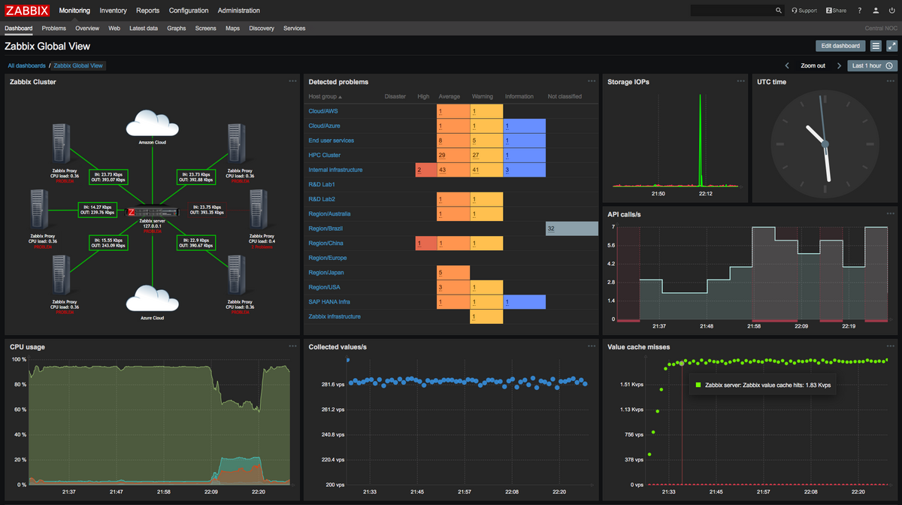

# Zabbix

**Zabbix** یک سیستم متن‌باز برای نظارت بر عملکرد و مانیتورینگ زیرساخت‌های IT است که برای نظارت بر سرورها، شبکه‌ها، دستگاه‌ها، برنامه‌ها و سایر منابع سیستم استفاده می‌شود. Zabbix قابلیت جمع‌آوری داده‌ها از منابع مختلف را داراست و می‌تواند اطلاعات را به صورت real-time پردازش کرده و به مدیران سیستم هشدارهایی در صورت وقوع مشکلات ارائه دهد. این سیستم از پروتکل‌های مختلفی مانند SNMP، ICMP، HTTP، JMX و بسیاری دیگر برای جمع‌آوری اطلاعات پشتیبانی می‌کند و قادر به مانیتورینگ منابع شبکه‌ای، وضعیت سرورها، میزان مصرف منابع (مانند CPU، حافظه، فضای دیسک و ترافیک شبکه) و سرویس‌های مختلف می‌باشد.

**Zabbix** دارای یک داشبورد قدرتمند و قابل تنظیم است که کاربران می‌توانند وضعیت سیستم‌ها را به صورت گرافیکی مشاهده کنند. همچنین این سیستم از قابلیت‌های پیشرفته‌ای همچون ذخیره‌سازی تاریخچه داده‌ها، هشداردهی و ارسال گزارش‌ها، و همچنین اتوماسیون برای رفع مشکلات به صورت خودکار پشتیبانی می‌کند. با استفاده از Zabbix، سازمان‌ها می‌توانند به راحتی مشکلات سیستم را شناسایی کرده و اقدامات اصلاحی لازم را به سرعت انجام دهند. این ابزار معمولاً برای نظارت بر سیستم‌های بزرگ و پیچیده در محیط‌های مختلف از جمله مراکز داده، ابرها، و شبکه‌های توزیع‌شده مورد استفاده قرار می‌گیرد.

## اسکرین شات

در زیر یک تصویر از رابط کاربری Zabbix آورده شده است:



### جهت اجرای Zabbix با استفاده از Docker Compose، دستور زیر را وارد کنید:

```bash
sudo docker compose up -d
```


