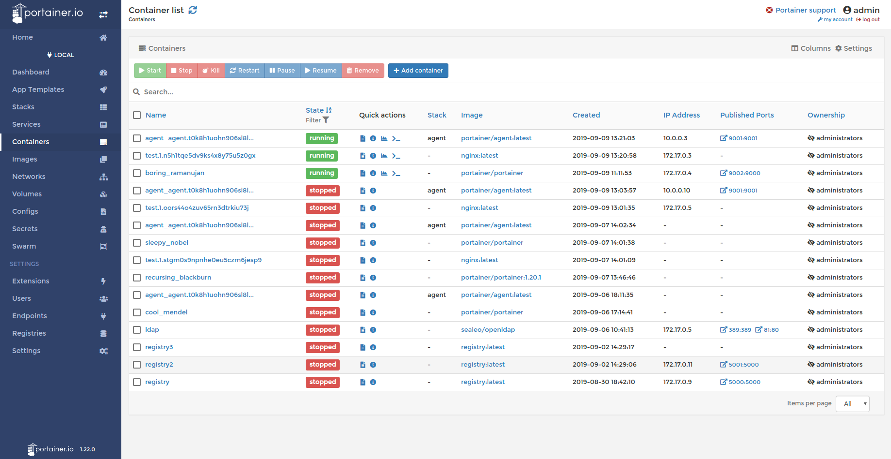

# Portainer

**Portainer** یک ابزار مدیریت و نظارت قدرتمند و ساده برای Docker و Kubernetes است که از طریق یک رابط کاربری وب، امکان مدیریت کانتینرها، ایماژها، شبکه‌ها، و حجم‌های Docker را فراهم می‌کند. این ابزار به کاربران این امکان را می‌دهد تا بدون نیاز به دستورات پیچیده CLI، به راحتی محیط‌های Docker خود را مدیریت کنند. Portainer می‌تواند در محیط‌های کوچک تا بزرگ با چندین گره به‌طور مؤثر اجرا شود و ویژگی‌هایی نظیر مشاهده لاگ‌ها، بررسی وضعیت کانتینرها، مدیریت ایماژها، و تنظیمات شبکه را ارائه می‌دهد. همچنین از قابلیت‌هایی مثل تخصیص منابع، تنظیم مجوزهای دسترسی، و پیاده‌سازی سیاست‌های امنیتی پشتیبانی می‌کند که آن را به ابزاری محبوب برای تیم‌های DevOps و توسعه‌دهندگان تبدیل کرده است.

## اسکرین شات

در زیر یک تصویر از رابط کاربری Portainer آورده شده است:



### جهت اجرای Portainer با استفاده از Docker Compose، دستور زیر را وارد کنید:

```bash
sudo docker compose up -d
```


