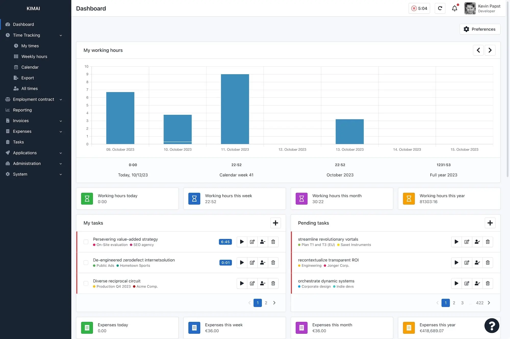

# Kimai

**Kimai** یک نرم‌افزار متن‌باز برای مدیریت زمان و ردیابی پروژه‌ها است که به‌ویژه برای تیم‌ها و فریلنسرها طراحی شده است. این ابزار به کاربران این امکان را می‌دهد که زمان صرف‌شده بر روی پروژه‌ها و وظایف مختلف را به‌راحتی ثبت کنند و گزارش‌های دقیق و تحلیلی از فعالیت‌های خود بدست آورند. Kimai به‌طور خاص برای کسانی که به دنبال ثبت ساعات کاری برای پروژه‌های مختلف هستند، طراحی شده و رابط کاربری ساده و کاربرپسندی دارد که استفاده از آن را بسیار راحت می‌کند. این سیستم از چندین زبان و ارز پشتیبانی می‌کند و به شما امکان می‌دهد که گزارش‌ها و تایم‌لاین‌ها را به دلخواه شخصی‌سازی کنید.

از امکانات کلیدی Kimai می‌توان به ردیابی زمان، تعریف پروژه‌ها و مشتریان مختلف، تولید گزارش‌های دقیق و تحلیلی، و امکان تعریف وظایف گوناگون برای هر پروژه اشاره کرد. همچنین این سیستم قابلیت اتصال به دیگر ابزارها از طریق API را دارد و می‌توانید به‌راحتی آن را با دیگر سیستم‌ها ادغام کنید. از دیگر ویژگی‌های مهم Kimai می‌توان به پشتیبانی از افزونه‌ها و پلاگین‌های مختلف، توانایی محاسبه هزینه‌ها بر اساس زمان صرف‌شده، و امکان استفاده به‌صورت چندکاربره برای تیم‌ها اشاره کرد. این ویژگی‌ها باعث می‌شود Kimai ابزاری ایده‌آل برای محاسبه ساعات کاری، مدیریت پروژه‌ها و تولید صورتحساب‌ها باشد.

## اسکرین شات

در زیر یک تصویر از رابط کاربری Kimai آورده شده است:



### جهت اجرای Kimai با استفاده از Docker Compose، دستور زیر را وارد کنید:

```bash
sudo docker compose up -d
```


