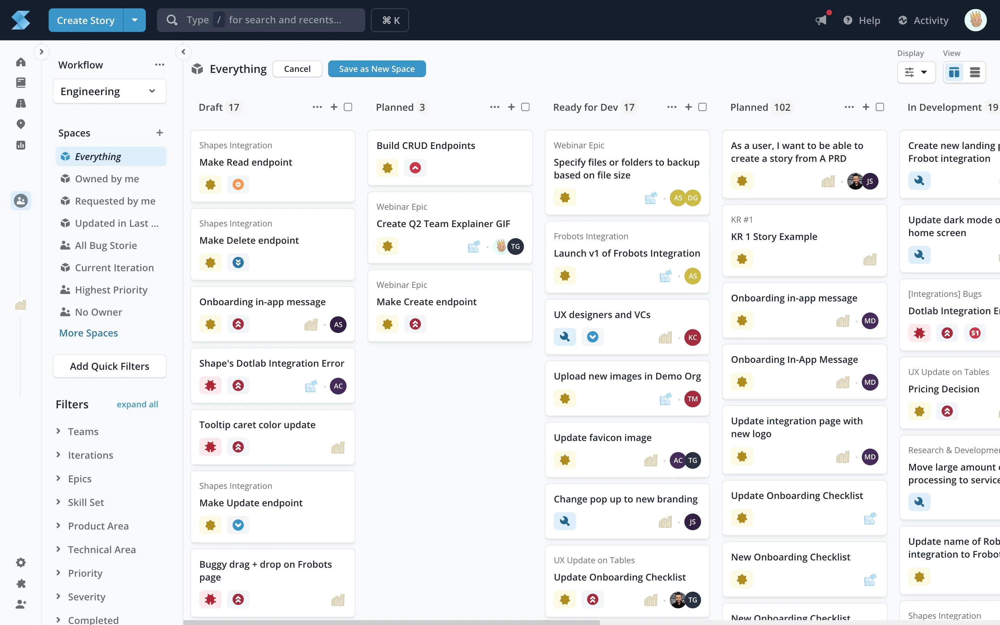

# Shortcut

**Shortcut** (که قبلاً با نام Clubhouse شناخته می‌شد) یک ابزار مدیریت پروژه مبتنی بر اصول چابک (Agile) است که برای تیم‌های نرم‌افزاری طراحی شده است. این ابزار به تیم‌ها کمک می‌کند تا پروژه‌ها و وظایف خود را به روشی ساده و کاربرپسند مدیریت کنند. Shortcut به‌ویژه برای تیم‌هایی که از روش‌های اسکرام یا کانبان برای برنامه‌ریزی و پیگیری کارها استفاده می‌کنند، مناسب است. رابط کاربری آن بسیار ساده است و قابلیت‌های متنوعی برای تیم‌ها فراهم می‌آورد تا به‌راحتی بتوانند پروژه‌ها را مدیریت کرده و وضعیت آن‌ها را پیگیری کنند. این ابزار با توجه به نیازهای خاص تیم‌های توسعه نرم‌افزار طراحی شده و امکاناتی مانند ایجاد و پیگیری تسک‌ها، بک‌لاگ‌ها، و مایل‌استون‌ها را در اختیار می‌گذارد.

از امکانات کلیدی Shortcut می‌توان به مواردی همچون مدیریت اسکرام و کانبان، پیگیری پیشرفت پروژه‌ها، و امکان همکاری تیمی اشاره کرد. این ابزار به شما اجازه می‌دهد که وظایف مختلف را به تیم‌ها اختصاص داده و آن‌ها را اولویت‌بندی کنید. علاوه بر این، Shortcut با گزارش‌دهی پیشرفته و داشبوردهای تحلیلی قدرتمند خود، به تیم‌ها کمک می‌کند که وضعیت پروژه را در زمان واقعی مشاهده کنند و با شفافیت کامل تصمیم‌گیری کنند. این ابزار از قابلیت‌های API برای یکپارچه‌سازی با سایر ابزارهای تیم‌های توسعه نیز پشتیبانی می‌کند و می‌تواند به‌راحتی در جریان کاری شما گنجانده شود. Shortcut همچنین از قابلیت‌های چت، پیغام‌رسانی و اعلان‌ها بهره‌مند است و باعث تسهیل در همکاری میان اعضای تیم می‌شود.

## اسکرین شات

در زیر یک تصویر از رابط کاربری Shortcut آورده شده است:



### جهت اجرای Shortcut با استفاده از Docker Compose، دستور زیر را وارد کنید:

```bash
sudo docker compose up -d
```


