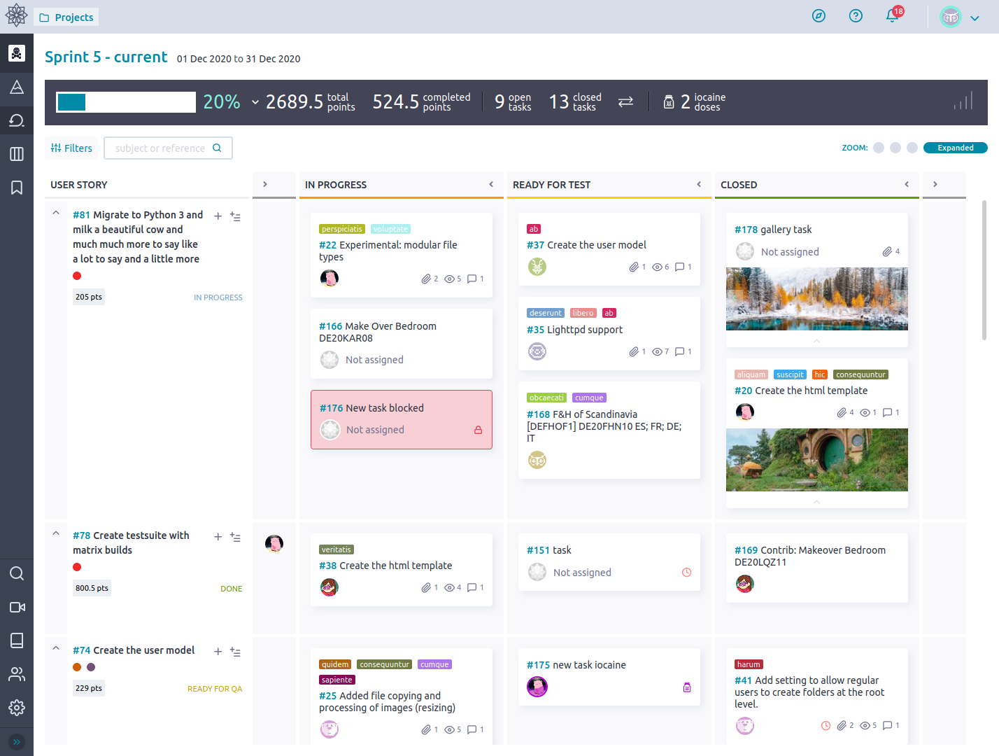

# Taiga

**Taiga** یک ابزار مدیریت پروژه‌ی منبع‌باز است که برای تیم‌های نرم‌افزاری و توسعه‌دهندگان طراحی شده و از متدولوژی‌های چابک مانند اسکرام و کانبان پشتیبانی می‌کند. این ابزار به تیم‌ها کمک می‌کند تا پروژه‌های خود را با بهره‌وری بالا مدیریت کرده و در هر مرحله از توسعه، از ایده‌پردازی تا تحویل، پیشرفت خود را پیگیری کنند. Taiga با رابط کاربری ساده و کاربرپسند خود، به‌راحتی می‌تواند مورد استفاده قرار گیرد و نیاز به آموزش زیاد ندارد. این پلتفرم همچنین برای تیم‌هایی که می‌خواهند پروژه‌های خود را به‌صورت باز و شفاف مدیریت کنند، گزینه‌ی مناسبی است.

از جمله امکانات کلیدی Taiga می‌توان به مدیریت تسک‌ها، بک‌لاگ‌ها، اسپرینت‌ها و مایل‌استون‌ها اشاره کرد. این ابزار امکان پیاده‌سازی اسکرام و کانبان را به‌طور کامل دارد و قابلیت‌های گزارش‌دهی و داشبوردهای تحلیلی قدرتمندی برای پیگیری عملکرد تیم ارائه می‌دهد. علاوه بر این، Taiga از قابلیت‌های همکاری و ارتباط تیمی برخوردار است و به تیم‌ها این امکان را می‌دهد که وظایف مختلف را به اعضای مختلف اختصاص داده و وضعیت پیشرفت آن‌ها را پیگیری کنند. همچنین این ابزار از یکپارچگی با سایر ابزارهای مدیریت پروژه مانند GitHub و GitLab پشتیبانی می‌کند و می‌تواند به‌راحتی در جریان کاری تیم گنجانده شود.

## اسکرین شات

در زیر یک تصویر از رابط کاربری Taiga آورده شده است:



### جهت اجرای Taiga با استفاده از Docker Compose، دستور زیر را وارد کنید:

```bash
sudo docker compose up -d
```


